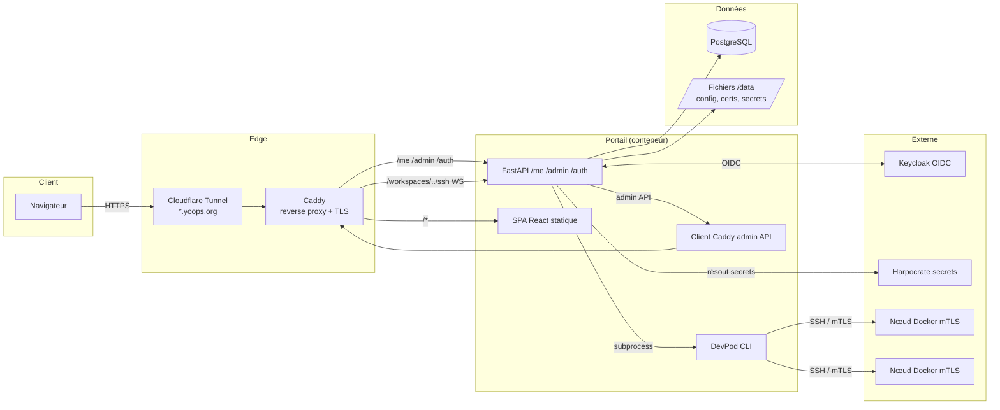
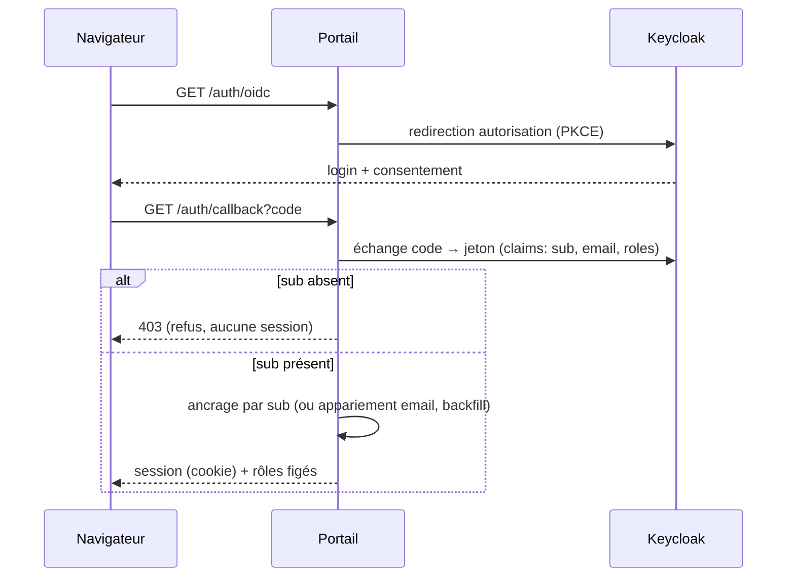
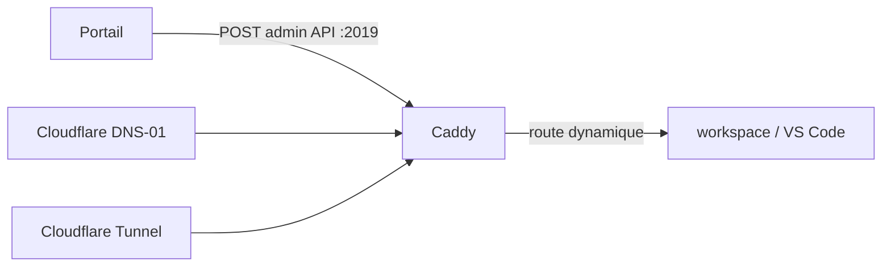
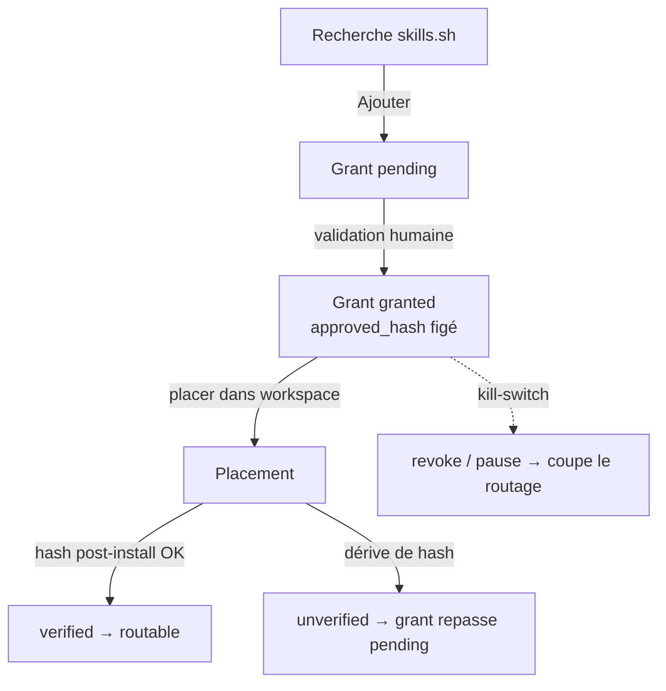
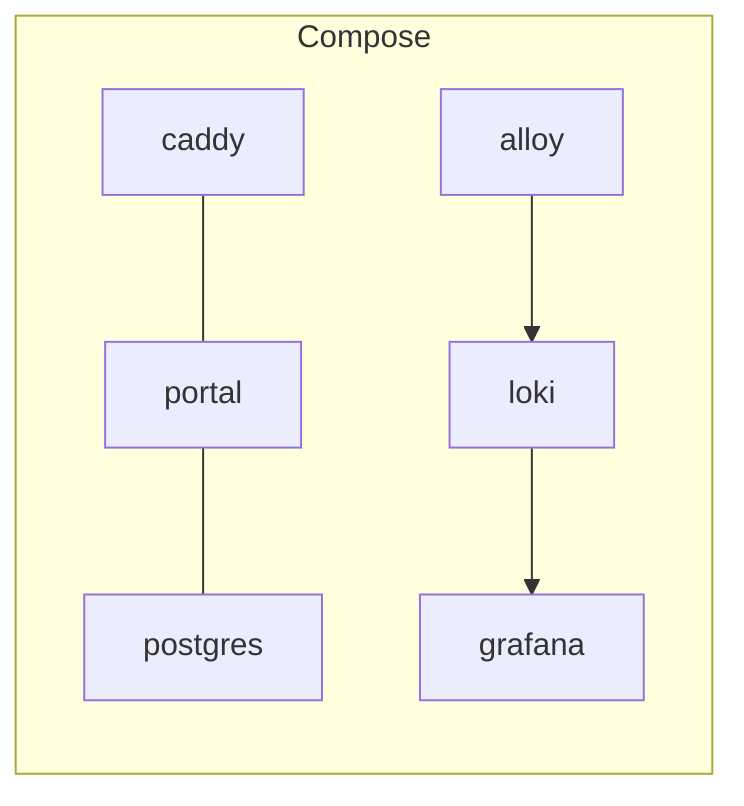

# Architecture & concepts

Cette partie décrit le fonctionnement interne du portail : composants, flux, et
concepts transverses (identité, secrets, exposition, nœuds, orchestration).

## Vue d'ensemble

**Principe** : le navigateur ne joint jamais un workspace directement. Tout passe
par Cloudflare → Caddy → portail (OIDC). Les workspaces sont des **conteneurs
Docker** provisionnés par **DevPod** sur des **nœuds distants** en mTLS.

## Stack technique

- **Backend** : Python 3.12 · FastAPI · pydantic v2 · authlib (OIDC) · httpx ·
  SQLAlchemy async (asyncpg) · structlog (JSON).
- **Frontend** : Vite · React 18 · TypeScript strict · TanStack Query · Tailwind ·
  shadcn/ui · i18next · xterm.js.
- **Reverse proxy** : Caddy (routes dynamiques via l'admin API, jamais par
  réécriture+reload), TLS wildcard DNS-01 Cloudflare.
- **Orchestration** : DevPod CLI (appelé en subprocess — DevPod n'a pas d'API).
- **Auth** : Keycloak (realm `yoops`, client `workspace-portal`, rôles `dev`/`admin`).

## Persistance (hybride)

Deux sources de vérité complémentaires :

| Support | Contenu | Référence |
|---------|---------|-----------|
| **PostgreSQL** (SQLAlchemy async) | grants/placements skills, délégations, sessions, messages agents, déploiements compose, certs nœuds, préférences… | `backend/src/portal/db/tables.py`, migrations Alembic |
| **Fichiers `/data`** (YAML + PEM) | config par utilisateur (`config.yaml`), CA & certs, secrets inline, état local DevPod | `backend/src/portal/db/user_config.py`, `/data/certs/`, `/data/.devpod` |

> Écritures fichiers **atomiques** (`tempfile` + `os.replace`) ; la CA n'est
> **jamais** régénérée (`install.sh` idempotent).

## Identité (ancrage sur le `sub` OIDC)

L'identité canonique est le **`sub`** : changer d'email ou de nom d'affichage ne
crée pas un nouveau compte. Les rôles sont **rafraîchis à chaque re-login** et
plafonnés par `SESSION_MAX_AGE`. (`backend/src/portal/auth/router.py`)

## Secrets

- **Harpocrate** (`harpocrate.yoops.org`) : namespace par utilisateur (`secret_ns`),
  base path `devpod`. Backend `inline` (YAML) en fallback.
- **Coffre local** : chiffré par une **KEK** (`PORTAL_VAULT_KEK`, 32 octets hex) ;
  déverrouillé par un **PIN** utilisateur. Les valeurs ne sont **jamais** exposées
  au navigateur : référencées par slug, révélées **côté serveur** au point
  d'injection. (`backend/src/portal/secrets/`, routes `/vault/*`)

## Exposition

Caddy est piloté **par son admin API** (`caddy:2019`) — les routes des
workspaces/VS Code sont ajoutées/retirées dynamiquement, jamais par réécriture de
Caddyfile + reload. TLS wildcard via **DNS-01 Cloudflare** ; exposition publique
via **Cloudflare Tunnel**. (`backend/src/portal/exposure/caddy.py`)

## Nœuds Docker (mTLS)

Les workspaces tournent sur des **nœuds distants** (daemons Docker) enrôlés en
**mTLS** :

- `scripts/install-node.sh` : token de join (usage unique, hashé, TTL court),
  génération de certificat avec **SAN = IP/hostname exacts**, NTP avant émission,
  drop-in systemd, pare-feu.
- La **CA** vit sous `/data/certs/ca/` (jamais régénérée) ; les certs des nœuds
  sont en base (migration `010_node_certificates.py`).
- Gérés via les écrans `/admin` (nœuds, hyperviseurs).

## Orchestration DevPod

DevPod n'ayant **pas d'API**, il est appelé en **subprocess** (exception assumée à
la règle « pas de subprocess »). L'accès aux workspaces passe par
`devpod ssh --stdio <ws_id>` utilisé comme **ProxyCommand** SSH. L'état local de
DevPod est sous `/data/.devpod`. (`backend/src/portal/devpod/`)

## Skills : grants, placements, gateway

Deux cycles de vie liés : le **grant** (autorisation per-user, humaine) et le
**placement** (installation per-workspace, vérifiée par hash). Une capability
n'est **routée à la gateway MCP** que si **grant granted ∧ placement verified ∧
hash concordant ∧ délégation valide** (double kill-switch, fail-closed).

## Événements & messagerie

- **Événements applicatifs** : registre fermé (`skill.available`,
  `workspace.created`, `session.created`…), émis après succès métier, avec un
  catalogue de schémas exposé sur `/schemas` (CloudEvents). Ajouter un type impose
  3 synchronisations (registre, dataSchema, tests).
- **Messagerie inter-agents** (spec 34) : un agent sollicite un autre workspace ;
  la **délivrance est pilotée par l'utilisateur** (le message reste `pending`
  jusqu'à transmission dans une session).

## Modèle de conteneurs (déploiement)

En **dev**, `docker-compose.dev.yml` embarque tout (portal, caddy, postgres,
loki, grafana, alloy). En **prod**, Postgres est externe. L'observabilité
(Alloy → Loki → Grafana) collecte logs et télémétrie front (Faro).

> Voir [Installation & exploitation](installation-exploitation.md) pour le détail
> des services, ports et variables d'environnement.
