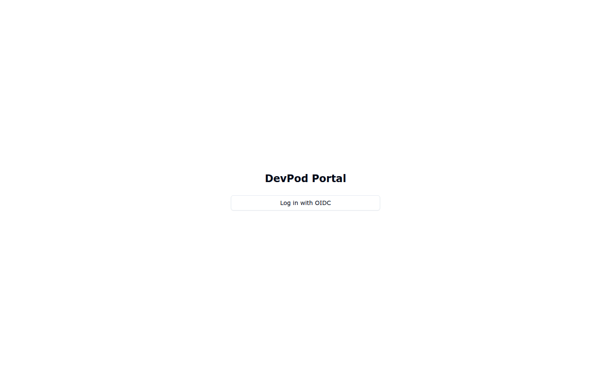

# Manuel utilisateur

Ce manuel s'adresse aux **développeurs** (rôle `dev`). Il couvre l'usage
quotidien du portail : se connecter, créer et piloter un workspace, obtenir un
VS Code dans le navigateur, gérer ses sessions SSH, ses skills, ses secrets, et
ses machines de test.

> Les actions d'administration (nœuds, hôtes, OIDC, réseau…) sont dans le
> [Guide administrateur](guide-administrateur.md).

## Sommaire

1. [Se connecter](#1-se-connecter)
2. [Le tableau de bord Workspaces](#2-le-tableau-de-bord-workspaces)
3. [Créer un workspace](#3-créer-un-workspace)
4. [Ouvrir VS Code dans le navigateur](#4-ouvrir-vs-code-dans-le-navigateur)
5. [Sessions SSH](#5-sessions-ssh)
6. [Barre de touches du terminal](#6-barre-de-touches-du-terminal)
7. [Skills (skills.sh)](#7-skills-skillssh)
8. [Kiosque d'applications](#8-kiosque-dapplications)
9. [Profils MCP & agents](#9-profils-mcp--agents)
10. [Identifiants Git](#10-identifiants-git)
11. [Coffre & secrets](#11-coffre--secrets)
12. [Machines de test](#12-machines-de-test)
13. [Messagerie inter-agents](#13-messagerie-inter-agents)
14. [Mon profil](#14-mon-profil)

---

## 1. Se connecter

Le portail est protégé par **OIDC (Keycloak)** : aucune identité locale, aucun
mot de passe stocké côté portail. À l'ouverture, l'écran de connexion propose un
unique bouton.

1. Cliquer sur **« Log in with OIDC »**.
2. S'authentifier sur Keycloak (identifiant + mot de passe de l'organisation).
3. Vous êtes redirigé vers le tableau de bord **Workspaces**.

> **Rôles** : votre compte porte le rôle `dev` (usage standard) ou `admin`
> (accès aux écrans d'administration). L'identité est ancrée sur le **`sub`
> OIDC** : changer d'email ou de nom d'affichage ne crée pas un nouveau compte.

---

## 2. Le tableau de bord Workspaces

C'est l'écran d'accueil. Il liste vos workspaces sous forme de **cartes**,
éventuellement rangées par **groupes**.

> 🖼️ _Capture à venir (écran authentifié)._

Chaque carte affiche :

- le **nom** du workspace et sa **source Git** ;
- des **tags** (agents/outils provisionnés, ex. `claude-code`, `tmux`, `python`) ;
- un **statut** : `running`, `stopped`, `provisioning`, `failed` ;
- des **actions** selon l'état :
  - workspace démarré → **`</>` (VS Code)**, un bouton carré (arrêt), le menu
    **« Sessions (N) »**, et le menu **⋮** (actions avancées) ;
  - workspace arrêté → **Démarrer** (▶), **Recréer**, **Supprimer**.

Les cartes s'**empilent en masonry** : les blocs comblent les espaces verticaux
au lieu de s'aligner sur la carte la plus haute. En fenêtre étroite, l'affichage
repasse sur une seule colonne.

**Groupes** — « New group » crée un groupe ; le menu ⋮ d'un workspace permet de
l'y ranger. Un groupe se replie/déplie et la préférence est mémorisée.

---

## 3. Créer un workspace

Bouton **« New workspace »** en haut à droite.

> 🖼️ _Capture à venir (formulaire de création)._

On renseigne :

- **Nom** (lettres minuscules, chiffres, tirets) ;
- **Source Git** (dépôt à cloner) et éventuellement la **branche** et un
  **identifiant Git** (voir §10) ;
- un **profil** de configuration et l'**IDE** (VS Code navigateur) ;
- des **recipes** (features devcontainer) et des **scripts de démarrage** ;
- des options d'exposition, de volumes, et d'agents à provisionner.

À la validation, le workspace passe en **`provisioning`** (DevPod construit le
conteneur sur un nœud) puis **`running`**.

---

## 4. Ouvrir VS Code dans le navigateur

Sur une carte de workspace démarré, cliquer sur **`</>`**. Un onglet s'ouvre
avec un **VS Code complet dans le navigateur** (openvscode-server), déjà branché
sur le dossier du workspace. Rien à installer sur votre poste.

> 🖼️ _Capture à venir (VS Code navigateur)._

> L'accès passe **toujours** par le portail (Caddy + OIDC) : aucun port n'est
> joignable directement (fail-closed).

---

## 5. Sessions SSH

Une **session** est un shell persistant (tmux) dans le workspace. Le menu
**« Sessions (N) »** de la carte les gère.

> 🖼️ _Capture à venir (menu Sessions déroulé)._

- **Première entrée** : _Nouvelle session_ → ouvre une boîte de dialogue (nom de
  session + éventuel script de démarrage).
- **En dessous** : la liste des sessions actives. **Un clic ouvre la session
  dans son propre onglet**, dont le titre reprend le nom de la session (ex.
  `devpod2 — devpod`).
- **Corbeille** au survol d'une session → suppression (avec confirmation : la
  session, son tmux et tout process en cours — y compris un agent — seront
  interrompus).

> Le tmux **survit** à la fermeture de l'onglet ou à un redéploiement du
> portail : rouvrir la session s'y **rattache** (le scrollback est conservé).

---

## 6. Barre de touches du terminal

En bas de la fenêtre de session, une **barre d'actions tactiles** (utile en
mobilité, sans clavier physique). Les boutons rendent le **service attendu**, ils
n'émulent pas des combinaisons brutes :

| Bouton | Effet |
|--------|-------|
| **Échap** | Envoie la touche Échap dans la session |
| **Interrompre** | Interrompt le processus au premier plan (SIGINT) |
| **Coller** | Colle le presse-papier dans la session |
| **Copier** | Copie la sélection du terminal vers le presse-papier |

> 🖼️ _Capture à venir (barre de touches)._

Si la connexion tombe (veille, réseau), un **overlay « Session déconnectée »**
propose **Reconnecter** : la session se rattache au tmux survivant.

---

## 7. Skills (skills.sh)

Les **skills** enrichissent vos agents. L'onglet **Skills** (page **Git
credentials** → onglet _Skills_) permet de les découvrir et de les faire valider.

> 🖼️ _Capture à venir (onglet Skills)._

- **Recherche** : saisir une requête → résultats de [skills.sh](https://skills.sh)
  (avec un **badge de risque** issu de l'audit). Chaque résultat porte un lien
  ↗ vers sa **page skills.sh**.
- **Ajouter** : crée une **demande de validation** (grant `pending`) — une skill
  n'est **jamais** utilisable sans **validation humaine** explicite.
- **Validations** : la file des demandes. On **examine** le `SKILL.md` (et son
  hash), puis on **valide** (le hash approuvé est figé), on **met en pause** ou
  on **révoque**.
- **Placement** : une skill validée s'installe dans un workspace ; son hash est
  vérifié après installation (`verified` / `unverified`).

---

## 8. Kiosque d'applications

Le **kiosque** (icône applications) rassemble des raccourcis vers vos outils.
Les tuiles sont gérées par l'administrateur pour les utilisateurs standard ; vous
cliquez pour ouvrir.

> 🖼️ _Capture à venir (kiosque)._

---

## 9. Profils MCP & agents

La page **Profils** définit des configurations réutilisables (serveurs MCP,
agents) appliquées à vos workspaces.

> 🖼️ _Capture à venir (profils)._

---

## 10. Identifiants Git

La page **Git credentials** stocke vos accès aux dépôts (clé SSH ou token),
réutilisés à la création d'un workspace pour cloner des dépôts privés.

> 🖼️ _Capture à venir (git credentials)._

---

## 11. Coffre & secrets

Vos secrets sont protégés par un **coffre** (vault) chiffré. À la première
utilisation, vous **initialisez** le coffre (PIN) ; ensuite vous le
**déverrouillez** pour révéler/injecter des secrets. Les valeurs ne sont
**jamais** exposées en clair côté navigateur : elles sont référencées par slug
et révélées côté serveur au moment de l'injection.

> 🖼️ _Capture à venir (déverrouillage du coffre)._

---

## 12. Machines de test

Depuis un workspace, vous pouvez attacher une **VM de test** (mutualiser des
services : navigateur headless, collecteur de logs…). Le bloc de la machine
apparaît sous la carte du workspace.

> 🖼️ _Capture à venir (bloc machine de test)._

Le menu **⋮** de la machine propose :

- **Ouvrir SSH** (`ssh testN` depuis le workspace) ;
- **Lancer un service** (déploiement compose) ;
- **Résoudre l'IP** ;
- **Gérer les liens** (raccourcis clé → URL) ;
- **Partager** (voir ci-dessous) ;
- **Supprimer** (détruit la VM).

**Stacks docker de la machine** — sous les services gérés par le portail, deux
sections en **lecture seule** montrent l'état docker réel : les **autres stacks
compose** (`docker compose ls`) et les **conteneurs hors compose** (`docker ps`).

### Partager une machine de test

Le menu **Partager…** rend la VM accessible en SSH à d'autres workspaces
**démarrés**.

> 🖼️ _Capture à venir (fenêtre Partager)._

- Cochez les workspaces à qui donner l'accès (le propriétaire est exclu) ; cocher
  **partage**, décocher **retire** l'accès.
- Chaque workspace coché reçoit l'accès `ssh testN` **et un message pour son
  agent** (à délivrer, voir §13).
- Côté workspace cible, la VM apparaît en **bloc « Partagé par … »** (badge bleu),
  en **accès SSH seul** : pas de contrôle du cycle de vie (ni suppression, ni
  services) et **aucun bouton** sur les stacks affichées.

---

## 13. Messagerie inter-agents

Les agents d'un workspace peuvent **solliciter** un autre workspace (spec 34). La
**délivrance est pilotée par vous** : un message envoyé reste **en attente**
jusqu'à ce que vous le **transmettiez** depuis le portail.

> 🖼️ _Capture à venir (panneau messages)._

- Un **compteur** signale les messages en attente sur une carte.
- Vous **délivrez** un message dans une session active du workspace destinataire
  (refusé si l'agent est occupé), ou vous le **rejetez**.

---

## 14. Mon profil

La page **Mon profil** permet de consulter/éditer votre identité portail (email,
nom d'affichage). L'ancrage sur le `sub` OIDC garantit qu'un même utilisateur
reste le même compte, quel que soit l'email affiché.

> 🖼️ _Capture à venir (mon profil)._
