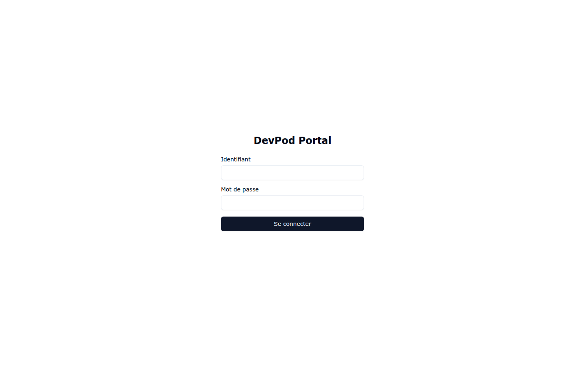
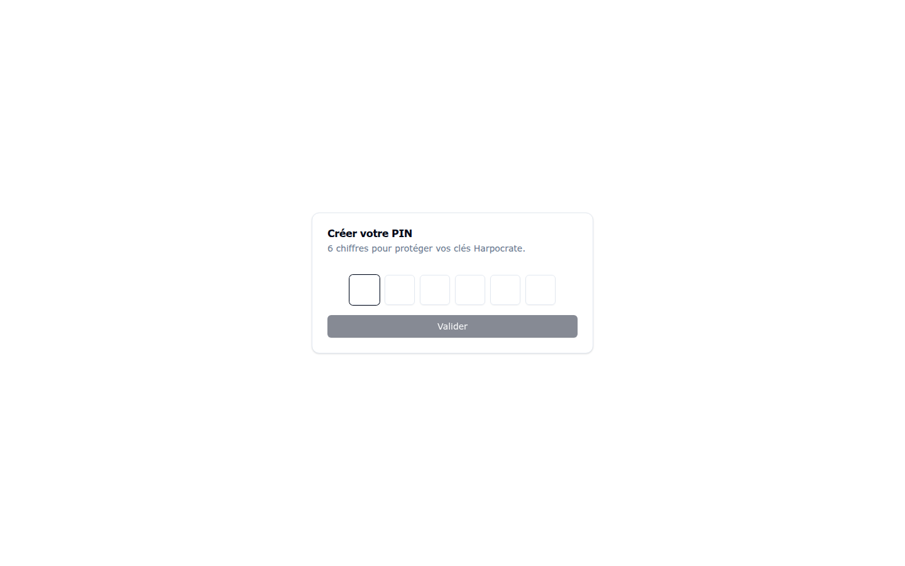

# Démarrage rapide — de la connexion au premier workspace

Ce tutoriel condense le parcours complet d'un nouvel utilisateur : **10 minutes** pour
obtenir un VS Code dans le navigateur, branché sur votre dépôt Git.

## Étape 1 — Se connecter et créer son PIN

Ouvrez l'URL du portail et connectez-vous (compte local ou SSO selon votre instance) :

À la première connexion, créez le **PIN à 6 chiffres** qui protège vos secrets :

## Étape 2 — (Dépôt privé uniquement) Enregistrer un accès Git

Si votre dépôt est public, passez directement à l'étape 3.

Pour un dépôt privé, direction **Services & Sécurité** (icône clé) :

1. Onglet **Secrets** → **+ Ajouter** : enregistrez votre PAT (le panneau « Comment
   obtenir un Personal Access Token ? » guide la création chez GitHub/GitLab/…).

   

2. Onglet **Credentials Git** → **+ Ajouter un credential** : associez la forge et le
   secret créé à l'instant.

   

## Étape 3 — Créer le workspace

Page **Workspaces** → **Nouveau workspace** :

1. **Nom** : `my-project` (minuscules, chiffres, tirets) ;
2. **Nœud** : laissez `— default —` ;
3. **Sources Git** → **+ Ajouter une source** : URL du dépôt + branche ;
4. facultatif : recettes start, actions d'initialisation, clé SSH dédiée ;
5. **Créer le workspace**.

La création clone le dépôt, construit le devcontainer et démarre le conteneur. Sur la
carte du workspace, le badge passe à **`en cours`** (vert) quand tout est prêt :

## Étape 4 — Ouvrir VS Code

Cliquez sur le bouton **`</>`** de la carte : VS Code s'ouvre dans un nouvel onglet,
connecté au workspace. Vous pouvez coder immédiatement — le dépôt est cloné, les
recettes sont appliquées.

## Étape 5 — Ouvrir un terminal

Le bouton **Terminal** de la carte ouvre la page des sessions :

**Créer une session** lance un terminal persistant côté serveur : fermez l'onglet,
revenez plus tard, votre session vous attend.

## Et ensuite ?

- Personnaliser VS Code (extensions, settings) → [chapitre 3](03-recettes-et-profils.md)
- Injecter des secrets et clés SSH dans le workspace → [chapitre 4](04-services-et-securite.md)
- Déployer une base de données ou un service annexe → [chapitre 5](05-docker-compose.md)
- Un problème ? → [FAQ / dépannage](07-faq-depannage.md)
