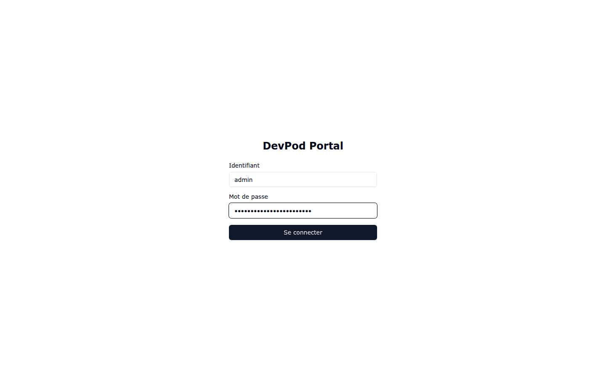
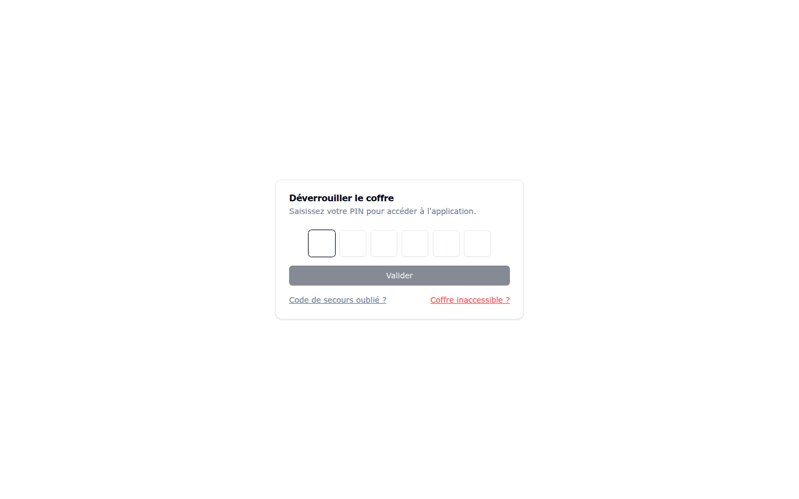
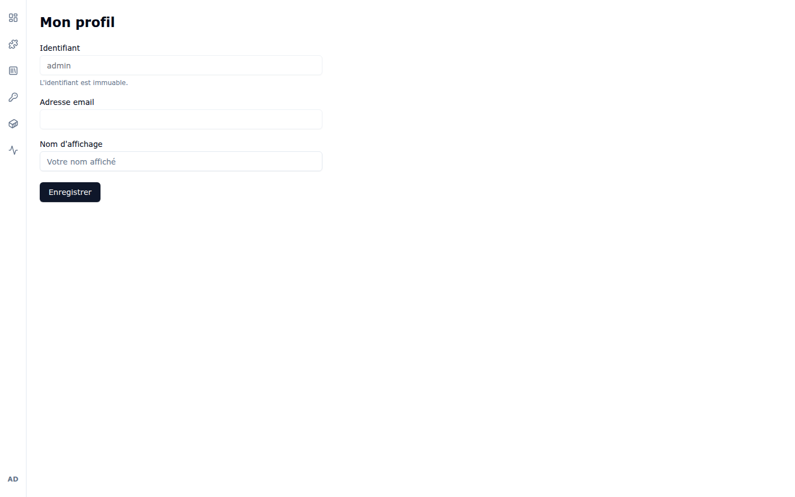

# 1. Premiers pas

## 1.1 Se connecter

Ouvrez l'URL du portail dans votre navigateur. La page de connexion s'affiche :

Deux modes de connexion existent selon la configuration de votre instance :

- **Compte local** : saisissez votre identifiant et votre mot de passe, puis cliquez
  sur **Se connecter**.
- **SSO d'entreprise (OIDC/Keycloak)** : si le SSO est activé, un bouton de connexion
  OIDC apparaît sous le formulaire. Vous êtes alors redirigé vers la mire de votre
  fournisseur d'identité.

Exemple avec le formulaire rempli :

Après authentification, vous arrivez sur la page **Workspaces**, page d'accueil du portail.

## 1.2 L'interface

L'interface s'organise autour d'un **rail de navigation vertical** à gauche de l'écran.
De haut en bas :

| Icône | Page | Rôle |
|-------|------|------|
| Tableau de bord | **Workspaces** | Vos environnements de développement |
| Pièce de puzzle | **Recettes** | Catalogue de recettes d'outillage |
| Colonnes | **Profils VSCode** | Profils d'extensions/paramètres VS Code |
| Clé | **Services & Sécurité** | Vault, secrets, credentials Git, MCP, règles, événements |
| Cube | **Docker Compose** | Galerie de services annexes à déployer |
| Courbe d'activité | **Logs** (lien externe) | Ouvre Grafana si les logs centralisés sont activés |

En bas du rail, vos **initiales** ouvrent le menu utilisateur.

## 1.3 Le menu utilisateur

Cliquez sur vos initiales en bas du rail :

Ce menu permet de :

- **Thème** : basculer entre thème clair et sombre.
- **Langue** : basculer entre français (FR) et anglais (EN).
- **Profil** : modifier votre adresse email et votre nom d'affichage (voir ci-dessous).
- **Se déconnecter** : fermer la session.

Si votre compte a le rôle `admin`, une section supplémentaire liste les pages
d'administration : **Réseau**, **Logs**, **Configuration OIDC**, **Types d'hyperviseurs**,
**Hyperviseurs**, **Hôtes Docker** et **Galeries** (sous-menu). Elles sont décrites au
[chapitre 6](06-administration.md).

## 1.4 Le coffre (PIN)

Vos secrets (clés SSH, tokens, clés API) sont protégés par un **PIN à 6 chiffres**,
distinct de votre mot de passe.

À la première connexion, le portail vous demande de créer ce PIN :

Aux connexions suivantes, le coffre doit être déverrouillé pour accéder à l'application :

- **Code de secours oublié ?** — procédure de récupération du PIN.
- **Coffre inaccessible ?** — dernier recours si le coffre ne peut plus être ouvert.

> Conservez précieusement votre code de secours : le portail ne stocke jamais vos clés
> en clair, un PIN perdu sans code de secours rend les secrets chiffrés irrécupérables.

## 1.5 Mon profil

L'entrée **Profil** du menu ouvre la page suivante :

- **Identifiant** : immuable, il ne peut pas être modifié.
- **Adresse email** et **Nom d'affichage** : modifiables, puis **Enregistrer**.

---

Chapitre suivant : [2. Workspaces](02-workspaces.md)
