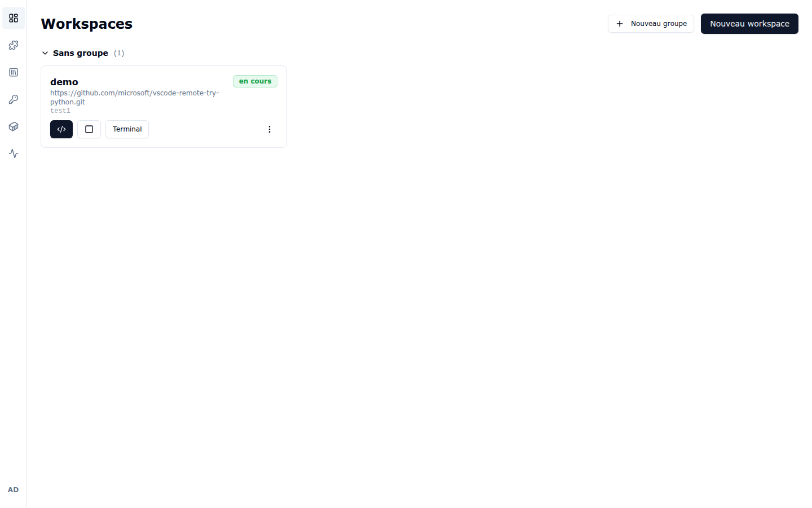
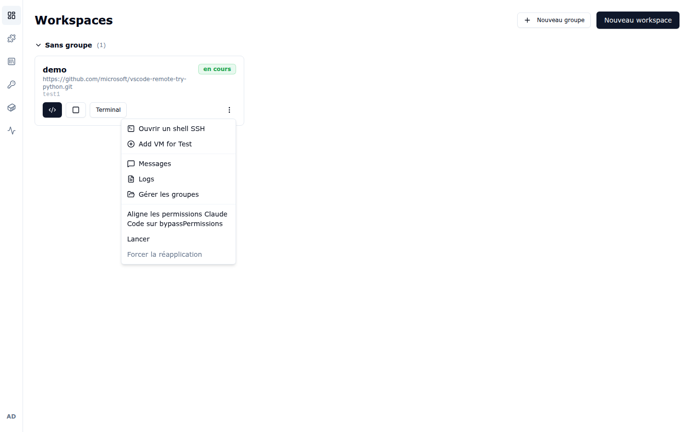
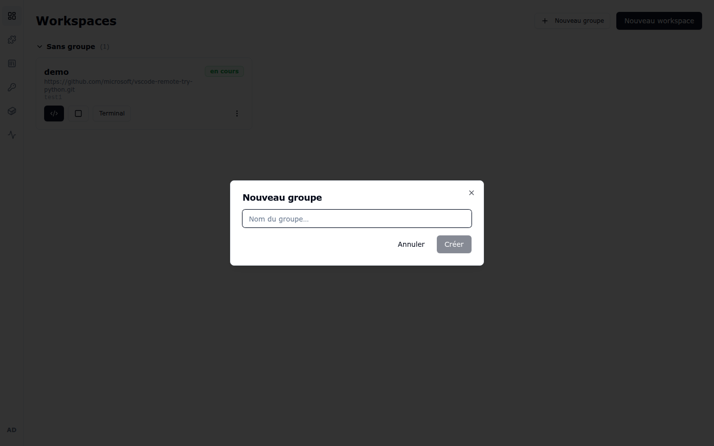
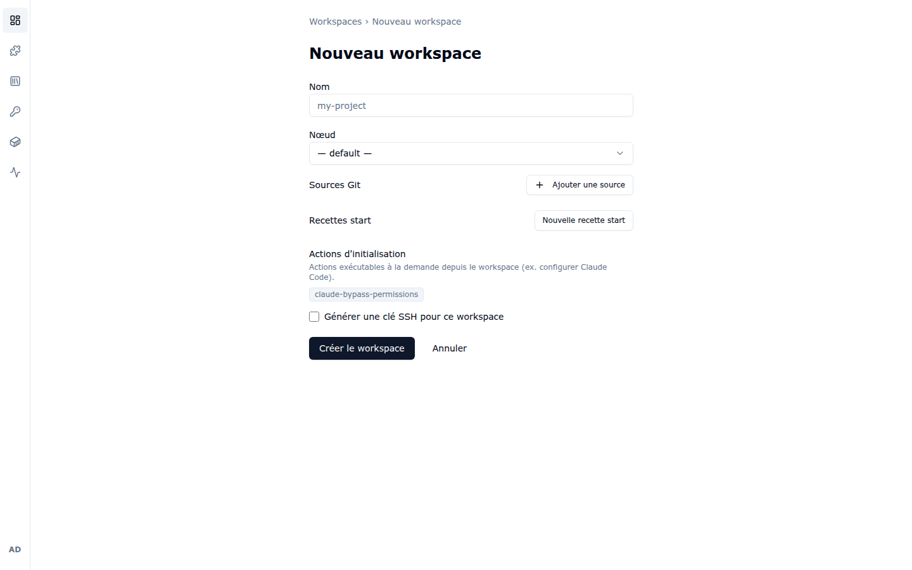
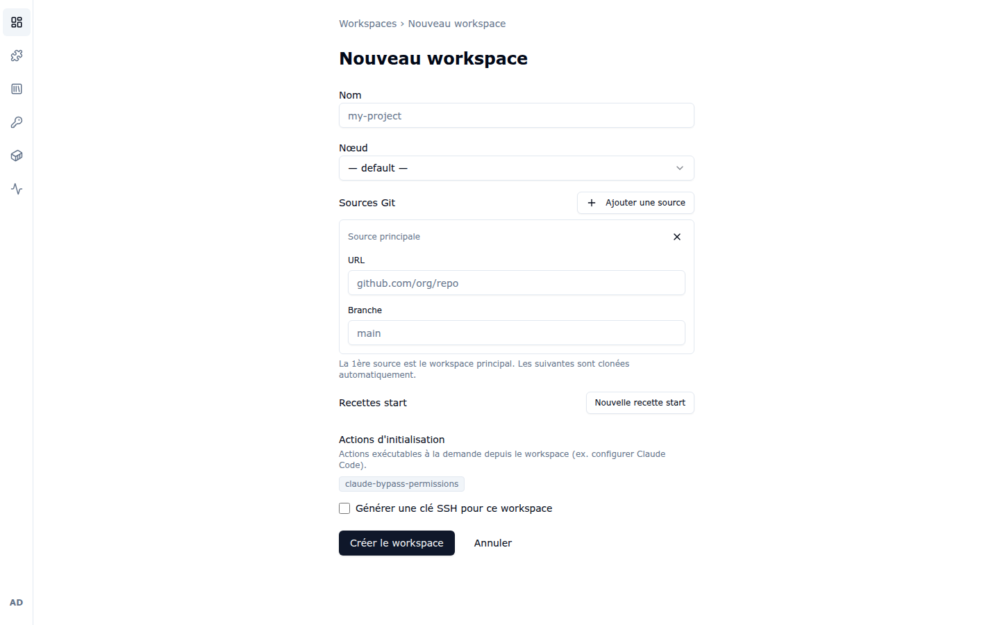
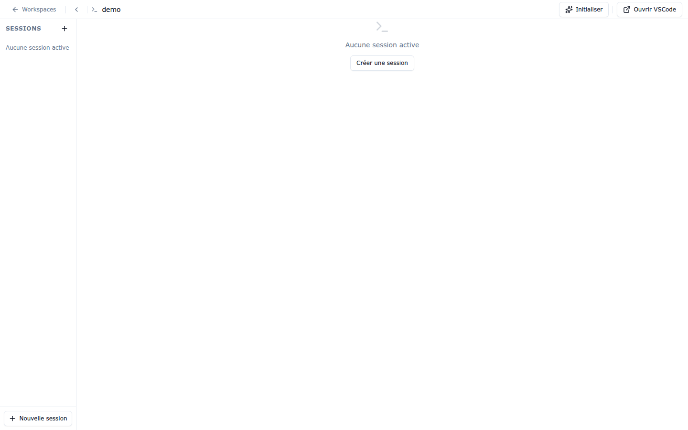

# 2. Workspaces

Un **workspace** est un environnement de développement complet (devcontainer) qui tourne
sur un nœud Docker distant : VS Code dans le navigateur, terminal, code cloné depuis Git,
outillage installé par recettes.

## 2.1 La liste des workspaces

La page **Workspaces** est la page d'accueil du portail :

Chaque carte affiche :

- le **nom** du workspace (`demo` ici) et son **état** (badge `en cours`, vert quand le
  workspace tourne) ;
- le **dépôt Git** cloné et le **nœud** qui héberge le conteneur (`test1`) ;
- une rangée de boutons d'action :
  - **`</>`** — ouvre **VS Code** dans le navigateur ;
  - **carré** — **arrête** le workspace (l'icône devient une flèche de démarrage quand il
    est arrêté) ;
  - **Terminal** — ouvre la page des sessions terminal (voir § 2.4) ;
  - **⋮** — menu contextuel avec les actions secondaires (redémarrage, suppression, etc.).

### Le menu contextuel ⋮

Le menu **⋮** de la carte donne accès aux actions secondaires :

- **Ouvrir un shell SSH** — instructions de connexion SSH au workspace ;
- **Add VM for Test** — met à disposition une machine de test associée au workspace ;
- **Messages** — messages contextuels du workspace (services mis à disposition, ports,
  messagerie inter-agents) ;
- **Logs** — logs du workspace (setup, agent, conteneur) ;
- **Gérer les groupes** — rattache le workspace à un groupe ;
- en bas, les **actions d'initialisation** configurées à la création (ici
  « Aligne les permissions Claude Code sur bypassPermissions ») avec **Lancer** et
  **Forcer la réapplication**.

### Les groupes

Les workspaces peuvent être rangés dans des **groupes** : le bouton **+ Nouveau groupe**
crée un groupe, et la section « Sans groupe » rassemble les workspaces non classés. Un
clic sur le chevron replie/déplie chaque groupe.

## 2.2 Créer un workspace

Cliquez sur **Nouveau workspace** en haut à droite :

Renseignez :

1. **Nom** — identifiant du workspace (ex. `my-project`). Il servira aussi dans les URLs,
   restez sur des minuscules/chiffres/tirets.
2. **Nœud** — la machine Docker qui hébergera le conteneur. `— default —` utilise le nœud
   par défaut défini par l'administrateur.
3. **Sources Git** — **+ Ajouter une source** pour ajouter un ou plusieurs dépôts à cloner
   dans le workspace. Pour chaque source : l'**URL** du dépôt et la **branche**. La
   première source est le workspace principal, les suivantes sont clonées automatiquement :

   
4. **Recettes start** — recettes exécutées au démarrage du workspace
   (voir [chapitre 3](03-recettes-et-profils.md)).
5. **Actions d'initialisation** — actions exécutables à la demande depuis le workspace
   (ex. `claude-bypass-permissions` pour configurer Claude Code).
6. **Générer une clé SSH pour ce workspace** — cochez pour que le portail génère une paire
   de clés propre au workspace (utile pour s'authentifier auprès de dépôts Git privés).

Validez avec **Créer le workspace**. La création clone les sources, construit le
devcontainer et démarre le conteneur : le badge d'état de la carte passe à `en cours`
quand tout est prêt.

## 2.3 Ouvrir VS Code

Sur la carte du workspace, cliquez sur le bouton **`</>`** : VS Code s'ouvre dans un
nouvel onglet du navigateur, connecté à votre workspace. L'accès est protégé : il passe
par le reverse proxy du portail et exige votre session authentifiée.

## 2.4 Sessions terminal

Le bouton **Terminal** de la carte ouvre la page plein écran de gestion des sessions :

- La colonne **Sessions** liste les sessions terminal actives du workspace.
- **Créer une session** / **+ Nouvelle session** ouvre un nouveau terminal dans le
  conteneur du workspace.
- La barre du haut propose :
  - **← Workspaces** — retour à la liste ;
  - **Initialiser** — lance les actions d'initialisation configurées à la création ;
  - **Ouvrir VSCode** — bascule vers VS Code web.

Les sessions restent actives côté serveur : vous pouvez fermer l'onglet et retrouver
votre terminal en revenant sur la page.

---

Chapitre précédent : [1. Premiers pas](01-premiers-pas.md) —
Chapitre suivant : [3. Recettes & profils VS Code](03-recettes-et-profils.md)
