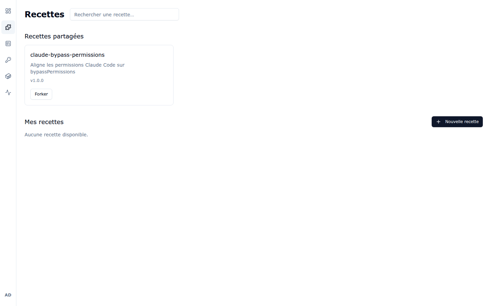
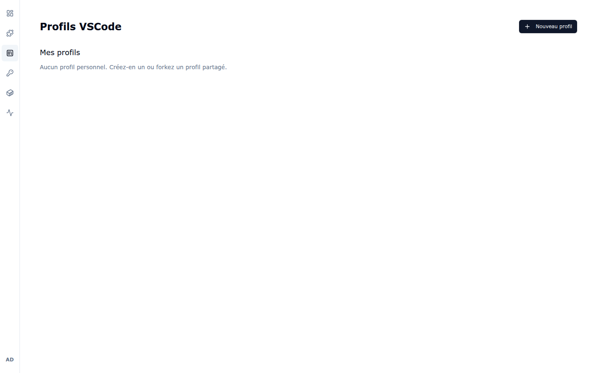
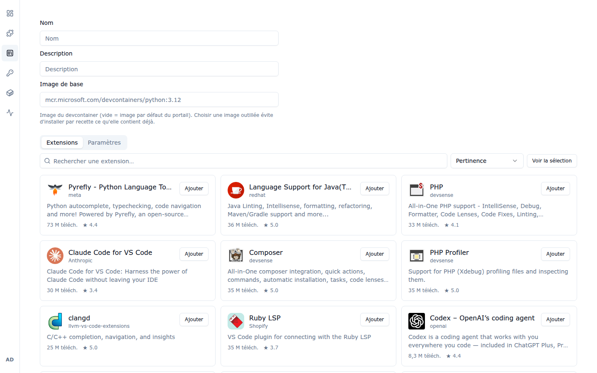
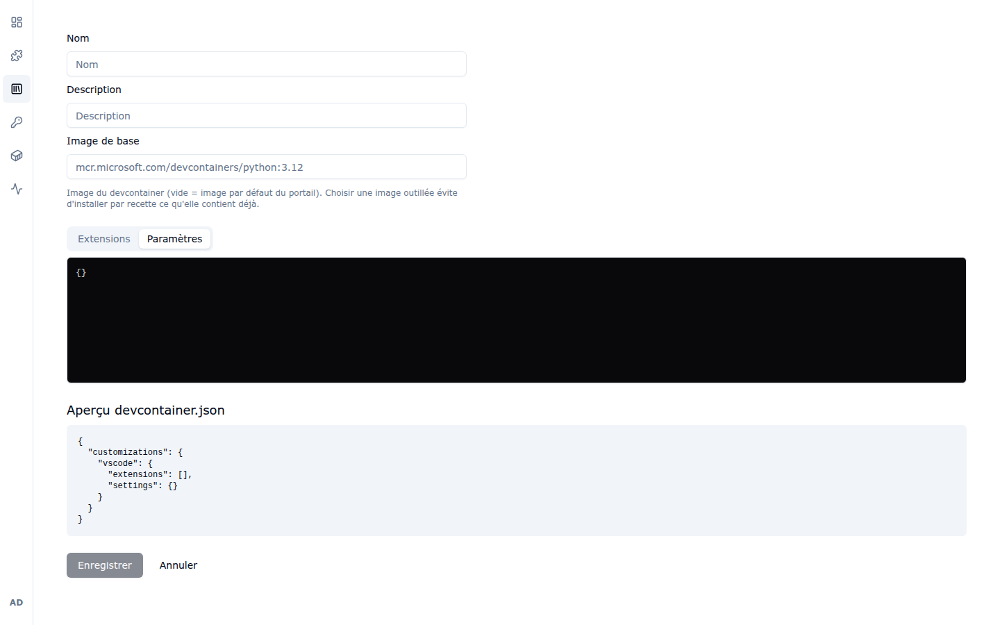

# 3. Recettes & profils VS Code

## 3.1 Les recettes

Une **recette** est un script d'installation ou de configuration réutilisable, appliqué à
un workspace (installation d'un langage, d'un outil CLI, configuration de Claude Code…).
La page **Recettes** (icône puzzle) présente le catalogue :

- **Recettes partagées** : recettes publiées pour tous les utilisateurs par
  l'administrateur (ici `claude-bypass-permissions`, avec sa description et sa version).
- **Mes recettes** : vos recettes personnelles.
- Le champ **Rechercher une recette…** filtre le catalogue.

Le bouton **Forker** copie une recette partagée dans « Mes recettes » afin de l'adapter à
vos besoins sans toucher à l'originale.

Les recettes s'utilisent ensuite dans le formulaire de création de workspace
(sections **Recettes start** et **Actions d'initialisation**,
voir [chapitre 2](02-workspaces.md#22-créer-un-workspace)).

## 3.2 Les profils VS Code

Un **profil VS Code** regroupe des extensions et des paramètres à appliquer au VS Code
d'un workspace. La page **Profils VSCode** liste vos profils :

- **Mes profils** : vos profils personnels. Vous pouvez en créer un de zéro
  (**+ Nouveau profil**) ou forker un profil partagé.

### Créer un profil

Le bouton **+ Nouveau profil** ouvre l'éditeur :

1. **Nom** et **Description** du profil.
2. **Image de base** — image du devcontainer (ex.
   `mcr.microsoft.com/devcontainers/python:3.12`). Laisser vide utilise l'image par
   défaut du portail. Choisir une image déjà outillée évite d'installer par recette ce
   qu'elle contient déjà.
3. Onglet **Extensions** — recherchez des extensions du marketplace (la recherche
   propose tri par pertinence et bouton **Voir la sélection**) et cliquez sur **Ajouter**
   pour les inclure au profil.
4. Onglet **Paramètres** — paramètres VS Code (JSON) appliqués avec le profil. Un
   **aperçu du `devcontainer.json`** généré s'affiche sous l'éditeur :

   

L'administrateur peut aussi mettre à disposition des **profils partagés** importés depuis
une galerie (Python Dev, .NET Dev, Rust Dev, etc. — voir
[chapitre 6](06-administration.md#64-galerie-de-profils-vs-code)).

---

Chapitre précédent : [2. Workspaces](02-workspaces.md) —
Chapitre suivant : [4. Services & Sécurité](04-services-et-securite.md)
