# 4. Services & Sécurité

La page **Services & Sécurité** (icône clé dans le rail) centralise tout ce qui touche
aux secrets, aux accès et à l'automatisation. Elle est organisée en huit onglets :
**Vault**, **Certificats**, **Secrets**, **Credentials Git**, **MCP**, **Services**,
**Règles** et **Événements**.

## 4.1 Vault — clés API

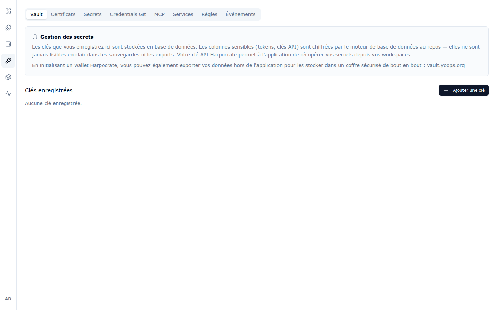

L'onglet **Vault** gère vos clés d'accès (tokens, clés API). Les valeurs sensibles sont
chiffrées au repos par le moteur de base de données : elles ne sont jamais lisibles en
clair dans les sauvegardes ni les exports. Votre clé API Harpocrate permet à
l'application de récupérer vos secrets depuis vos workspaces.

- **+ Ajouter une clé** : enregistre une nouvelle clé Harpocrate — libellé, description,
  clé API (`hrpv_1_…`) et URL du serveur Harpocrate :

  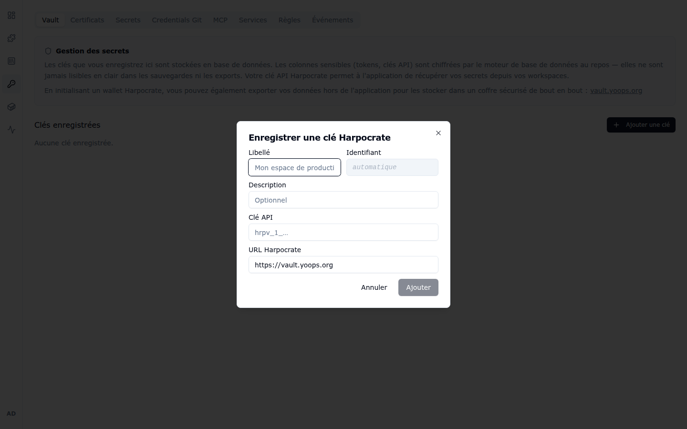

- En initialisant un **wallet Harpocrate**, vous pouvez également exporter vos données
  hors de l'application vers un coffre sécurisé de bout en bout.

## 4.2 Certificats & clés SSH

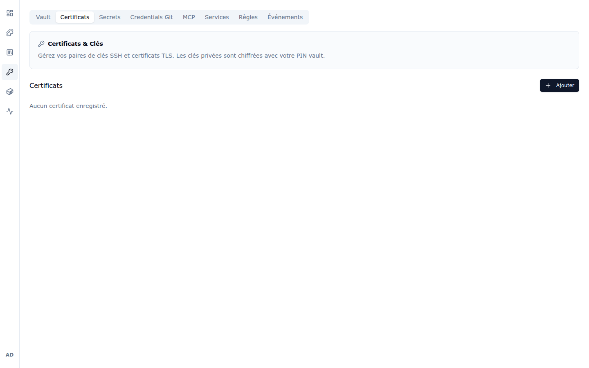

Gérez ici vos **paires de clés SSH** et **certificats TLS**. Les clés privées sont
chiffrées avec votre PIN vault. **+ Ajouter** ouvre le dialogue de création :

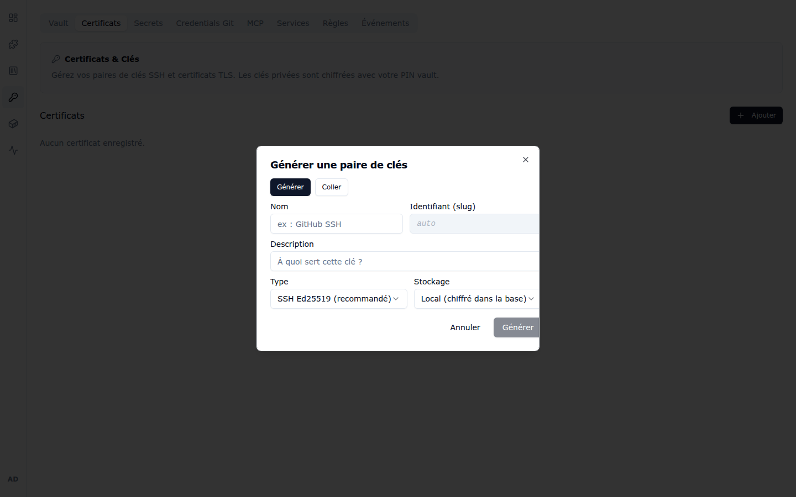

- **Générer** crée une nouvelle paire (type **SSH Ed25519** recommandé) ; **Coller**
  importe une clé existante.
- **Stockage** : « Local (chiffré dans la base) » par défaut.

## 4.3 Secrets & tokens

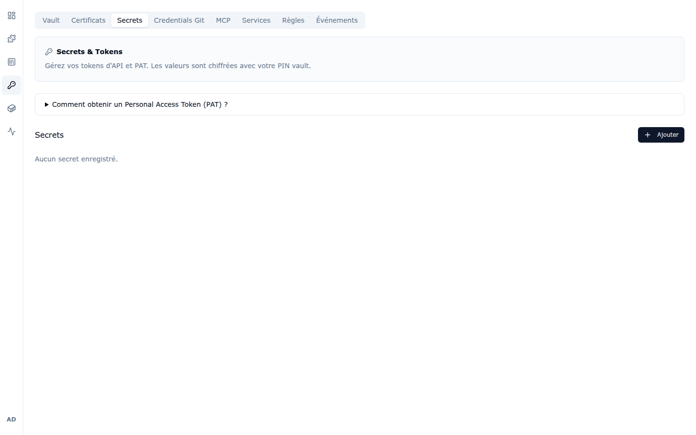

Stockez vos **tokens d'API et PAT** (Personal Access Tokens). Comme pour les
certificats, les valeurs sont chiffrées avec votre PIN vault.

- Le panneau dépliant **« Comment obtenir un Personal Access Token (PAT) ? »** guide la
  création d'un token chez GitHub, GitLab, Bitbucket et Azure DevOps, avec les scopes
  minimaux à accorder et un lien vers la documentation de chaque forge :

  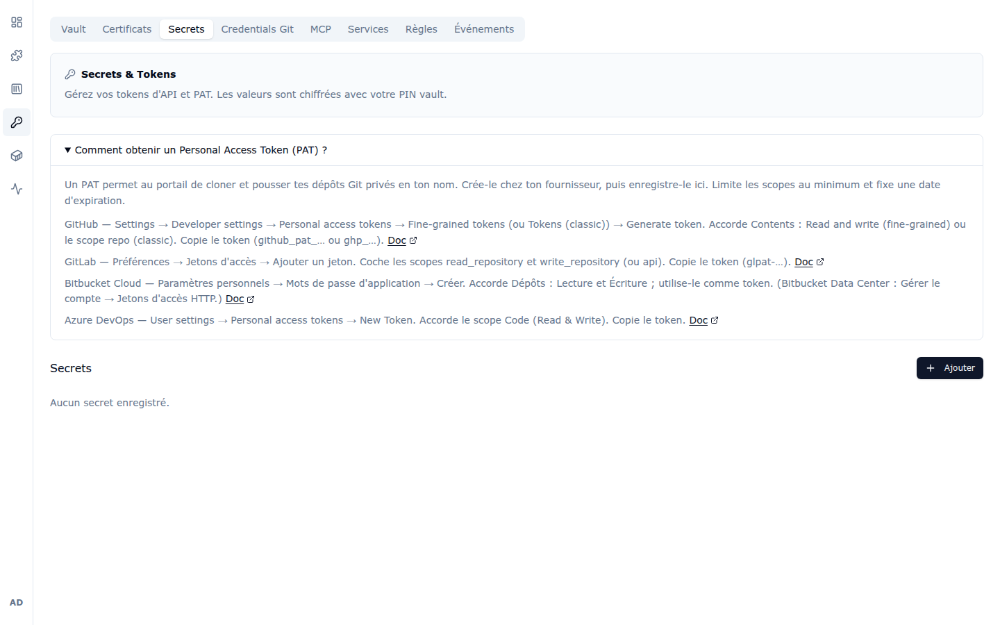

- **+ Ajouter** enregistre un nouveau secret — nom, identifiant (généré), description,
  **type** (ex. Personal Access Token — GitHub), **stockage** (Local chiffré en base) et
  la valeur du secret :

  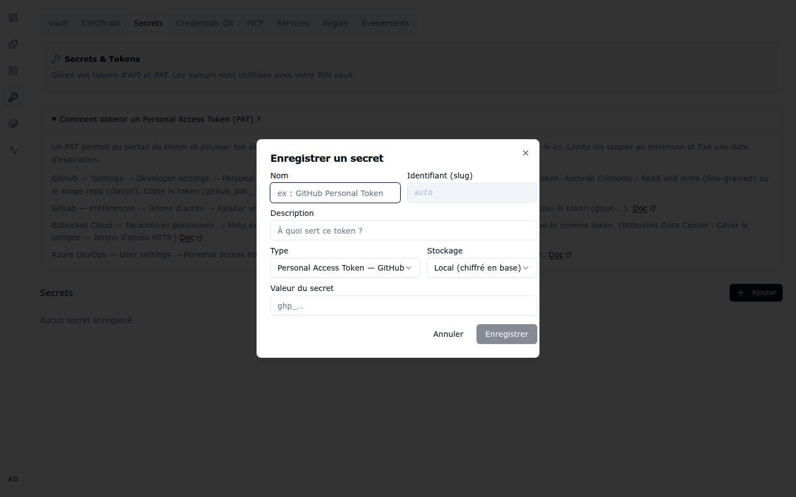

## 4.4 Credentials Git

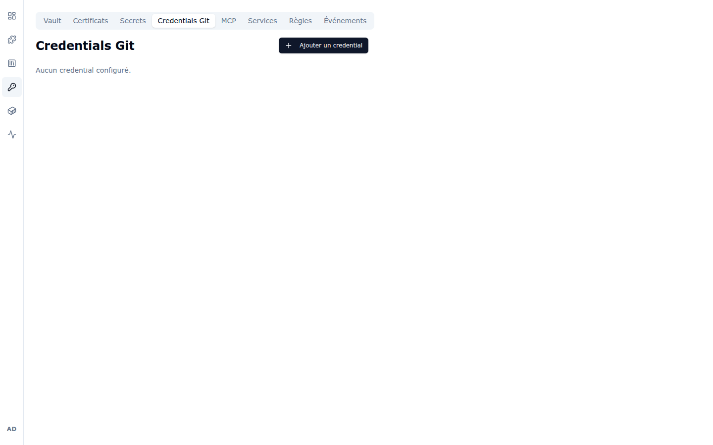

Les **credentials Git** permettent à vos workspaces de cloner et pousser sur des dépôts
privés sans jamais exposer le mot de passe dans le conteneur. **+ Ajouter un credential**
ouvre le formulaire :

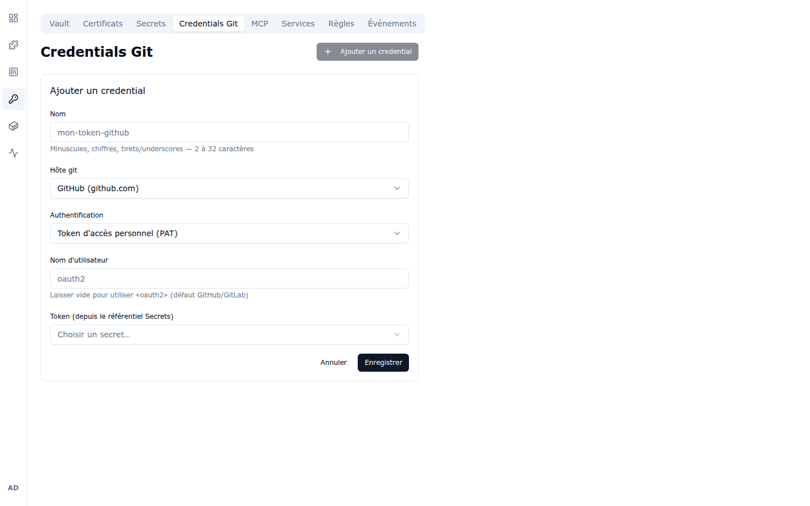

- **Nom** — identifiant du credential (minuscules, chiffres, tirets/underscores) ;
- **Hôte git** — la forge (GitHub, GitLab…) ;
- **Authentification** — ex. Token d'accès personnel (PAT) ;
- **Nom d'utilisateur** — vide = `oauth2` (défaut GitHub/GitLab) ;
- **Token** — choisi **depuis le référentiel Secrets** (onglet précédent) : le credential
  référence le secret, il ne duplique pas sa valeur.

## 4.5 MCP — serveurs, profils, clés et OAuth

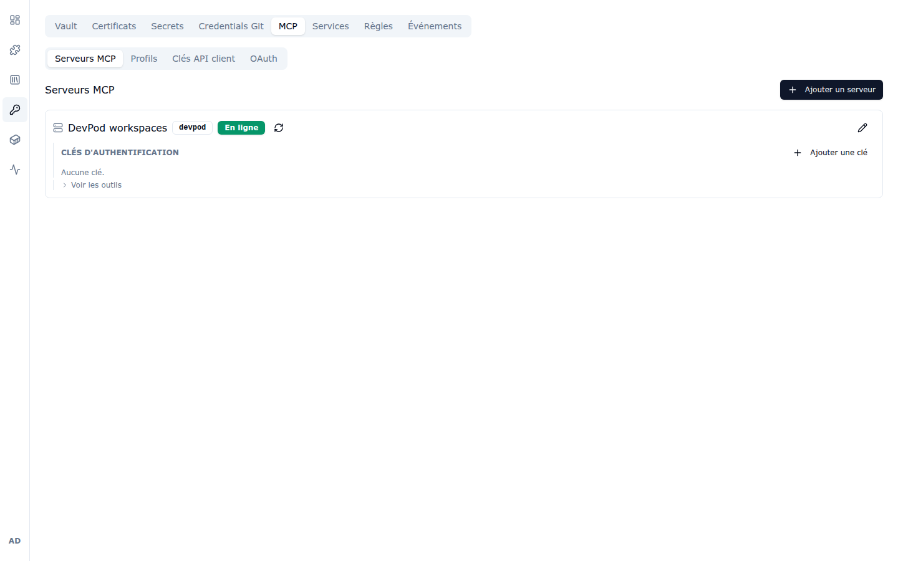

Cet onglet configure l'accès **MCP** (Model Context Protocol) utilisé par les agents IA
de vos workspaces. Il comporte quatre sous-onglets.

### Serveurs MCP

La liste des serveurs fédérés par la passerelle. La capture montre le serveur intégré
« DevPod workspaces » (tag `devpod`, badge **En ligne**). **Voir les outils** déplie la
liste complète des outils MCP exposés, avec leur description et leur impact
(read-only, write-safe, destructive…) :

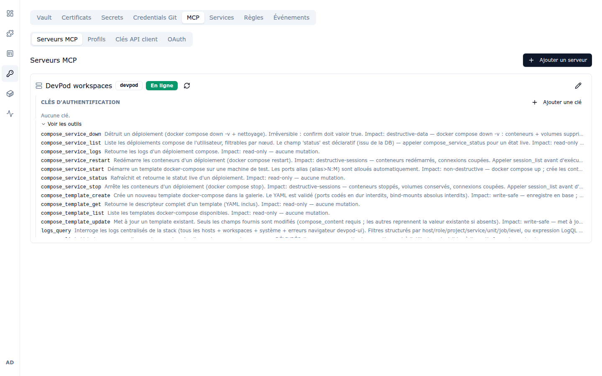

**+ Ajouter un serveur** fédère un serveur MCP externe : namespace (préfixe des outils),
nom, URL, transport (`streamable_http`) et URL d'application optionnelle :

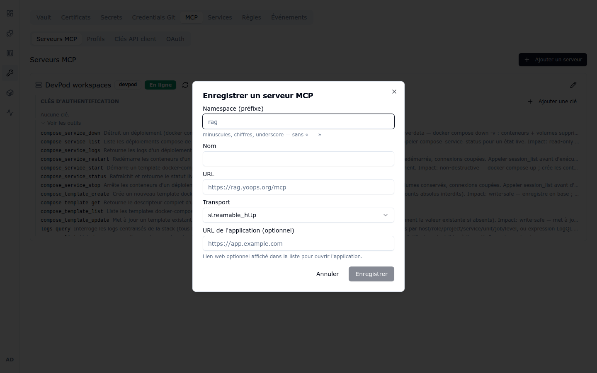

### Profils

Les **profils MCP** regroupent des autorisations d'accès aux services. **Configurer les
services** définit quels serveurs et quels outils le profil expose :

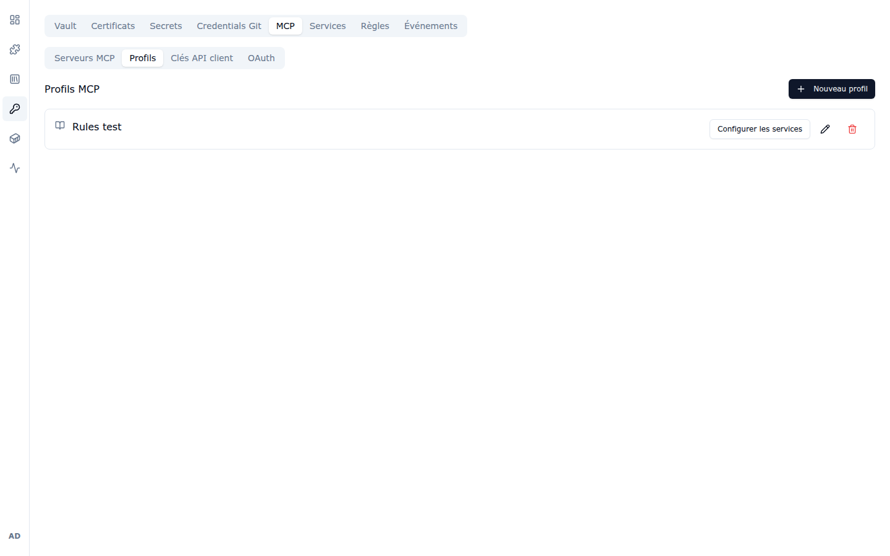

### Clés API client

Les **apikeys** permettent à un client MCP externe (Claude Desktop, scripts…) d'appeler
la passerelle. La page fournit le bloc de configuration prêt à coller — URL
`http://<portail>/mcp` et header `Authorization: Bearer <apikey>` — et le bouton
**+ Émettre une apikey** :

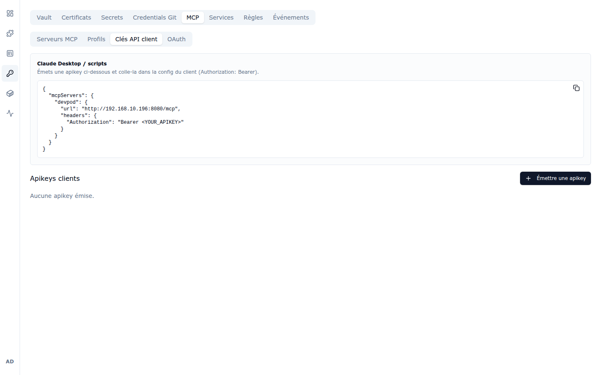

### OAuth

L'alternative sans apikey : ajouter la **passerelle MCP** comme connecteur personnalisé
dans Claude.ai (ou OpenAI, Gemini, Mistral). La page donne la procédure pas à pas ;
l'authentification passe par Keycloak et un écran de consentement où vous choisissez le
profil MCP à exposer. Les tokens OAuth sont de courte durée et se renouvellent
automatiquement :

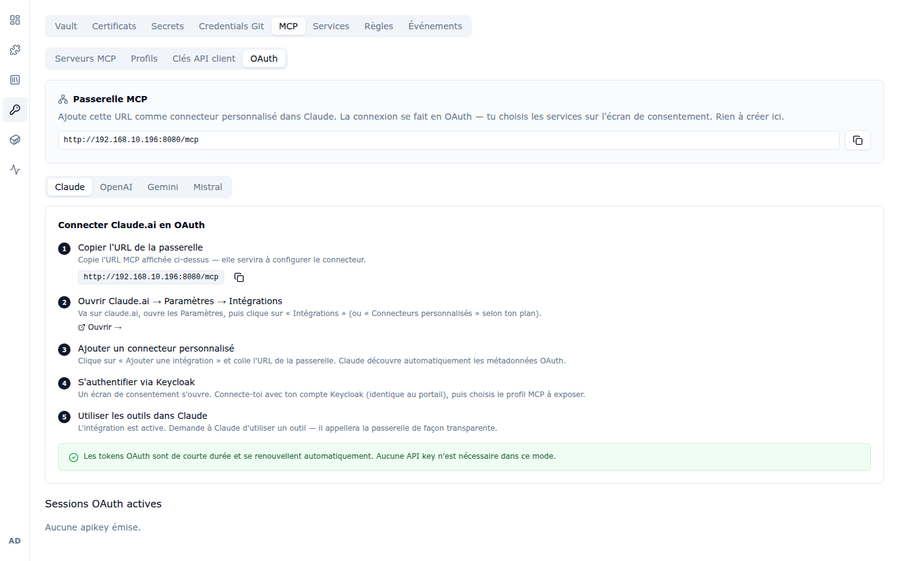

## 4.6 Services

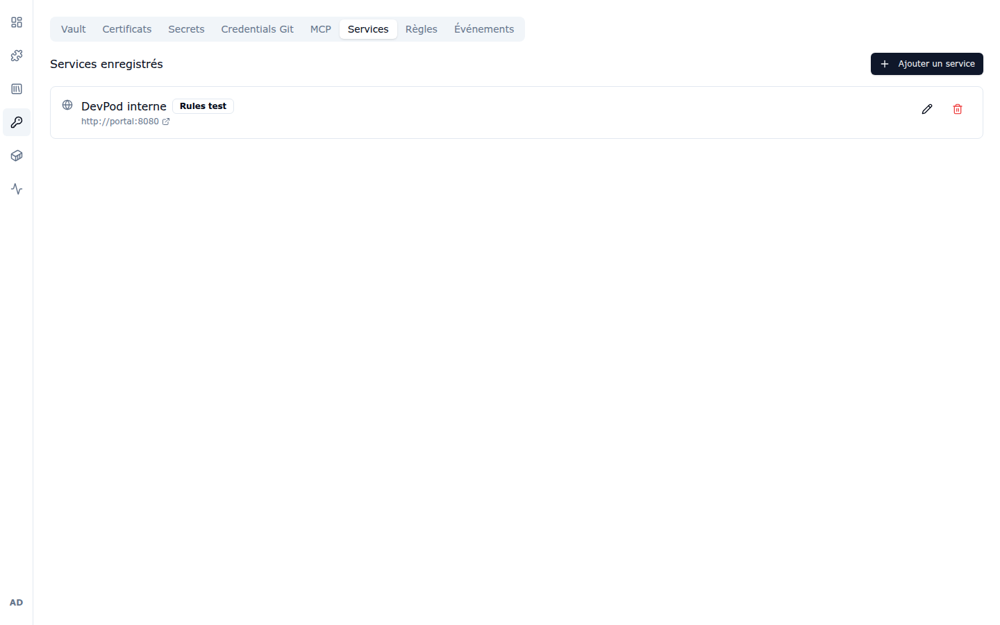

Les **services enregistrés** sont des endpoints MCP (le portail lui-même ou des services
externes) que les **règles d'automatisation** peuvent appeler. Chaque entrée affiche son
nom, le profil MCP associé et son URL. **+ Ajouter un service** demande un nom, une URL
et le **profil MCP** qui borne les outils accessibles ; le crayon édite, la corbeille
supprime :

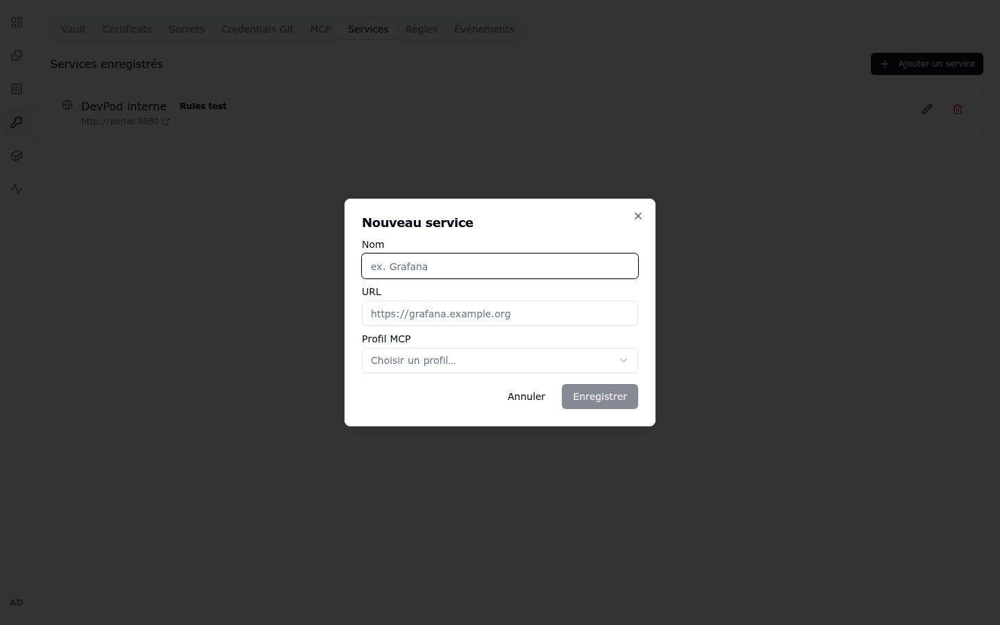

## 4.7 Règles d'automatisation

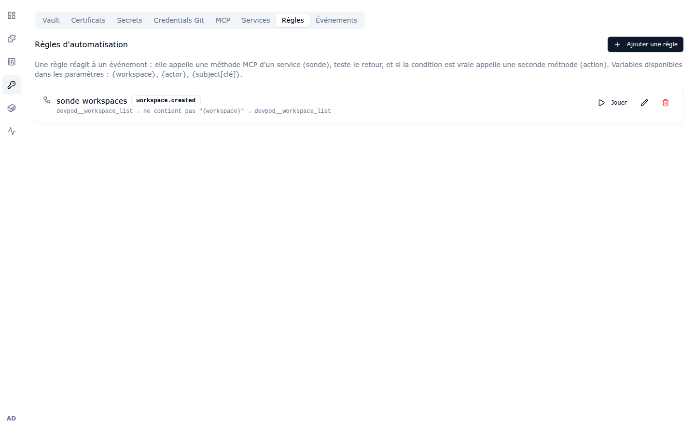

Une **règle** réagit à un événement du portail : elle appelle une méthode MCP d'un
service (la **sonde**), teste le retour avec une **condition**, et si la condition est
vraie appelle une seconde méthode (l'**action**). Les paramètres acceptent des
variables : `{workspace}`, `{actor}`, `{subject[clé]}`.

Sur la capture, la règle « sonde workspaces » est déclenchée par l'événement
`workspace.created` : elle appelle `devpod__workspace_list`, vérifie que le retour
« ne contient pas `"{workspace}"` », et enchaîne sur une autre méthode.

### Créer une règle

**+ Ajouter une règle** ouvre l'éditeur :

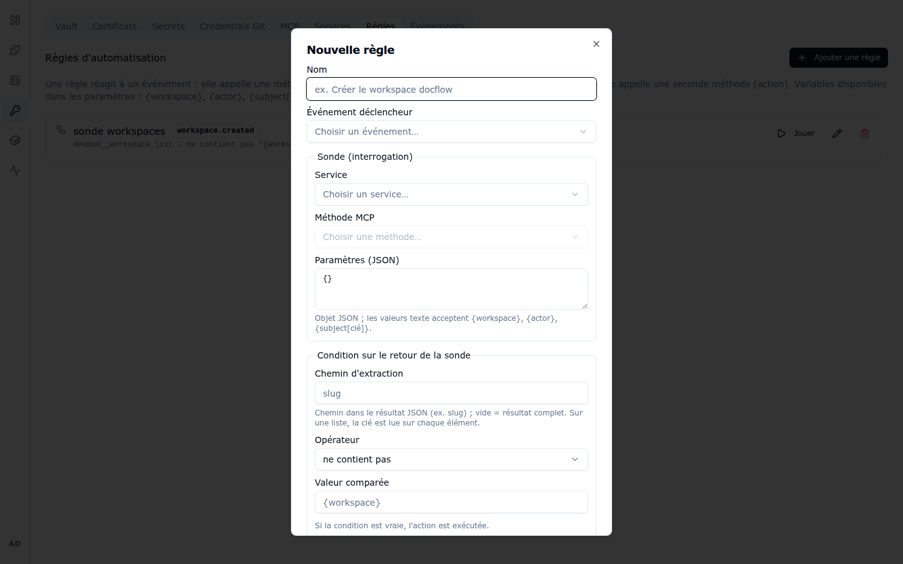

1. **Nom** et **événement déclencheur** (ex. `workspace.created`) ;
2. **Sonde (interrogation)** — service, méthode MCP et paramètres JSON (les valeurs
   texte acceptent `{workspace}`, `{actor}`, `{subject[clé]}`) ;
3. **Condition sur le retour de la sonde** — chemin d'extraction dans le résultat JSON
   (vide = résultat complet ; sur une liste, la clé est lue sur chaque élément),
   opérateur (`égal`, `différent`, `contient`, `ne contient pas`) et valeur comparée ;
4. plus bas : l'**action** (service + méthode + paramètres) exécutée si la condition est
   vraie, avec possibilité d'enchaîner d'autres actions.

Les conditions multiples se cumulent en **ET** ; la première condition fausse arrête la
règle.

### Tester une règle

**Jouer** exécute la règle immédiatement avec un appel MCP réel. Le dialogue demande un
**workspace de test** : cette valeur est injectée dans `{workspace}` pour l'essai, et
l'action est réellement exécutée si la condition est vraie :

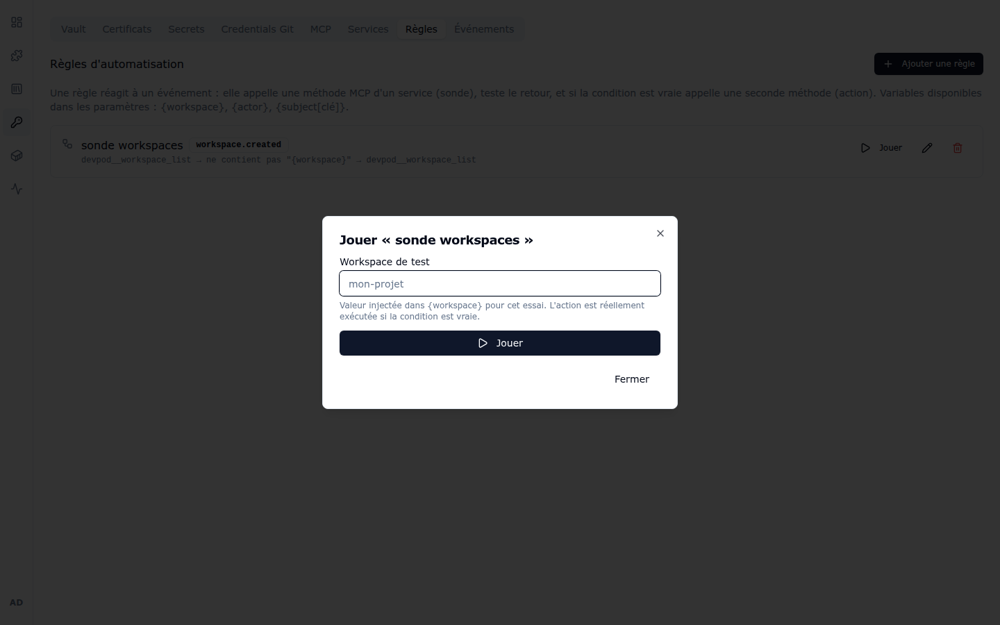

Le crayon édite la règle, la corbeille la supprime.

Les exécutions de règles sont tracées dans le journal des événements (onglet suivant).

## 4.8 Journal des événements

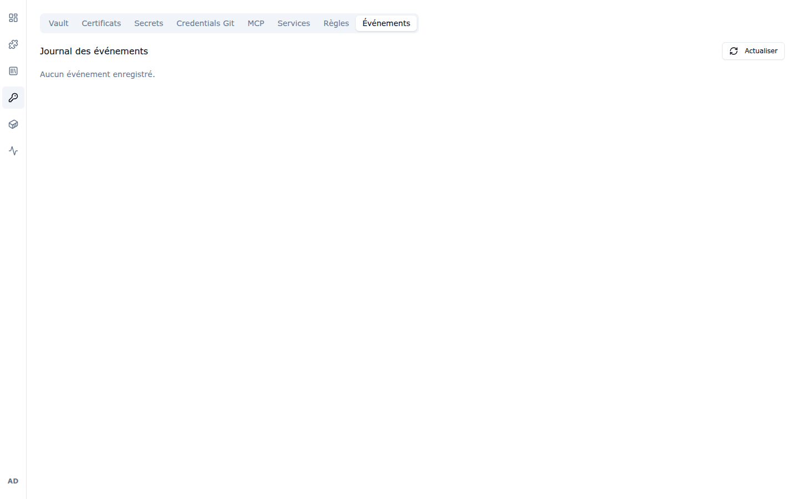

Le **journal des événements** liste les événements émis par le portail (création de
workspace, exécutions de règles avec leur détail par règle, etc.).

- **Actualiser** recharge la liste.
- Le journal est purgé automatiquement : les entrées de plus de **24 heures** sont
  supprimées par la tâche d'entretien horaire.

---

Chapitre précédent : [3. Recettes & profils VS Code](03-recettes-et-profils.md) —
Chapitre suivant : [5. Docker Compose](05-docker-compose.md)
