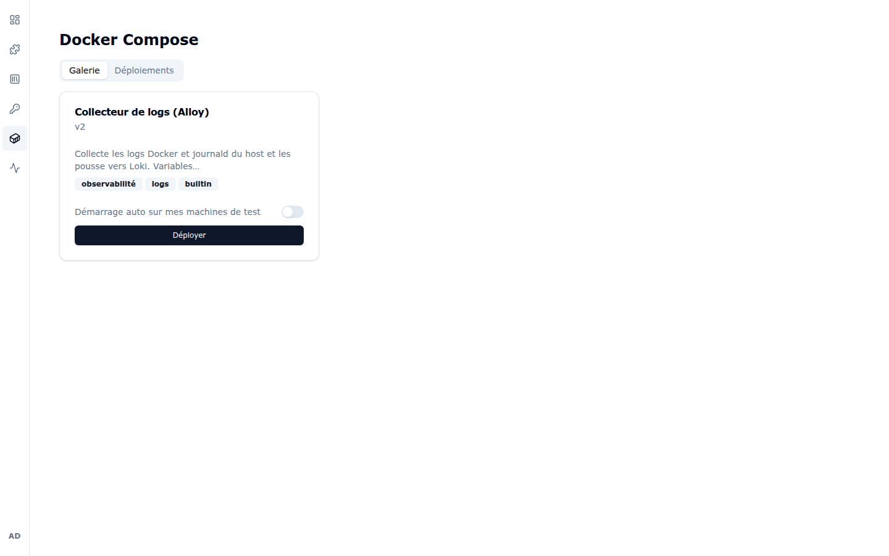
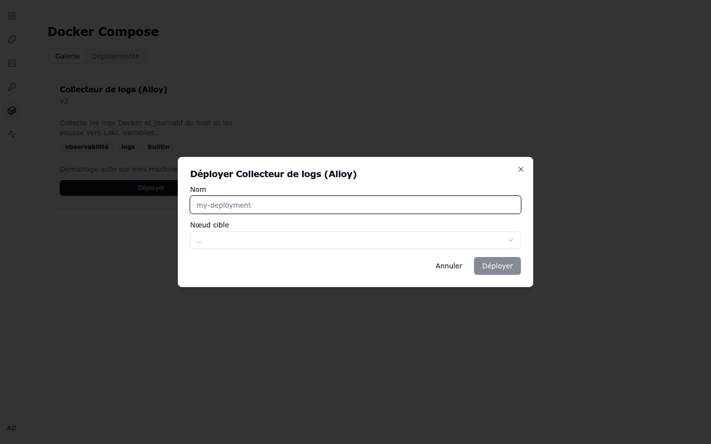

# 5. Docker Compose

La page **Docker Compose** (icône cube) permet de déployer des **services annexes** à
côté de vos workspaces : collecteur de logs, base de données de test, mock d'API…
Ces services sont définis par des templates Docker Compose fournis par l'administrateur.

## 5.1 Galerie

L'onglet **Galerie** liste les templates disponibles. Chaque carte affiche :

- le **nom** et la **version** du template (ici « Collecteur de logs (Alloy) », v2) ;
- sa **description** et ses **tags** (`observabilité`, `logs`, `builtin`) ;
- l'interrupteur **« Démarrage auto sur mes machines de test »** — quand il est activé,
  le service est déployé automatiquement sur vos machines de test ;
- le bouton **Déployer** — ouvre le dialogue de déploiement : nom du déploiement et
  **nœud cible**, plus les variables éventuelles du template :

  

## 5.2 Déploiements

L'onglet **Déploiements** liste vos services déployés avec leur état. C'est ici que vous
pouvez consulter les logs d'un service, le redémarrer, l'arrêter ou le supprimer :

> La création et la maintenance des templates eux-mêmes relèvent de l'administrateur —
> voir [chapitre 6, § Templates Compose](06-administration.md#65-templates-compose).

---

Chapitre précédent : [4. Services & Sécurité](04-services-et-securite.md) —
Chapitre suivant : [6. Administration](06-administration.md)
