# 6. Administration

> Ce chapitre nécessite le rôle **`admin`**. Les pages décrites ici sont accessibles via
> le menu utilisateur (initiales en bas du rail) : Réseau, Logs, Configuration OIDC,
> Types d'hyperviseurs, Hyperviseurs, Hôtes Docker et le sous-menu Galeries.

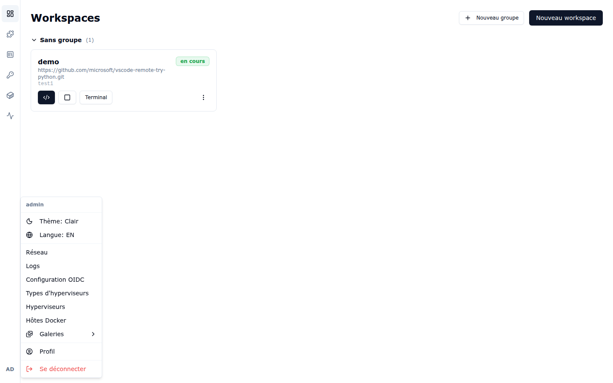

## 6.1 Hôtes Docker

Les **hôtes Docker** sont les nœuds qui hébergent les workspaces.

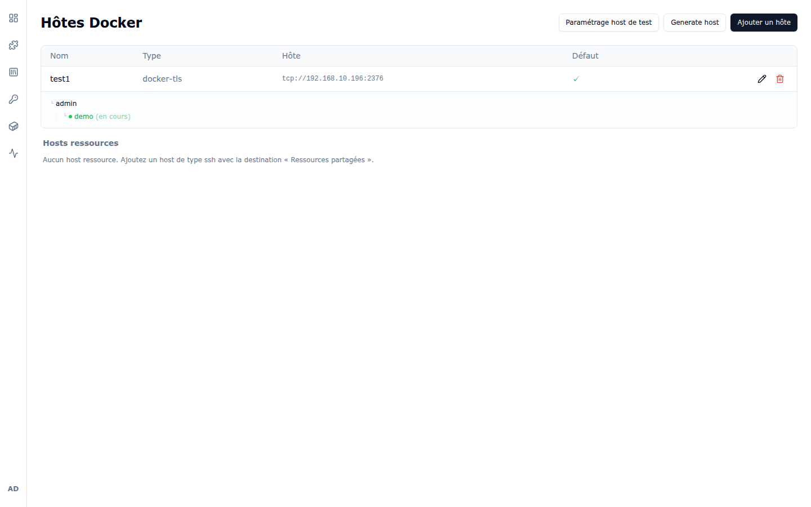

- Le tableau liste chaque nœud : **Nom**, **Type** (`docker-tls` = daemon Docker piloté
  en mTLS), **Hôte** (`tcp://…:2376`) et l'indicateur **Défaut** (nœud utilisé quand
  l'utilisateur choisit `— default —` à la création d'un workspace).
- Sous chaque nœud, une arborescence montre les workspaces hébergés, par utilisateur,
  avec leur état (ici `admin` → `demo (en cours)`).
- **Ajouter un hôte** enrôle un nouveau nœud : nom, type (`docker-tls`), URL du socket
  Docker (`tcp://…:2376`), **destination** (Workspaces ou Ressources partagées), mot de
  passe console Proxmox optionnel et case « Hôte par défaut » :

  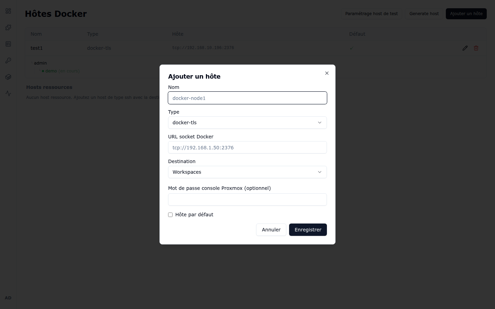

- **Generate host** génère une machine via un hyperviseur (voir § 6.4) ;
  **Paramétrage host de test** configure le comportement des machines de test.
- La section **Hosts ressources** accueille les hôtes de type `ssh` destinés aux
  « Ressources partagées » (services annexes mutualisés).

## 6.2 Galerie de recettes (scripts)

`Menu → Galeries → Recettes` :

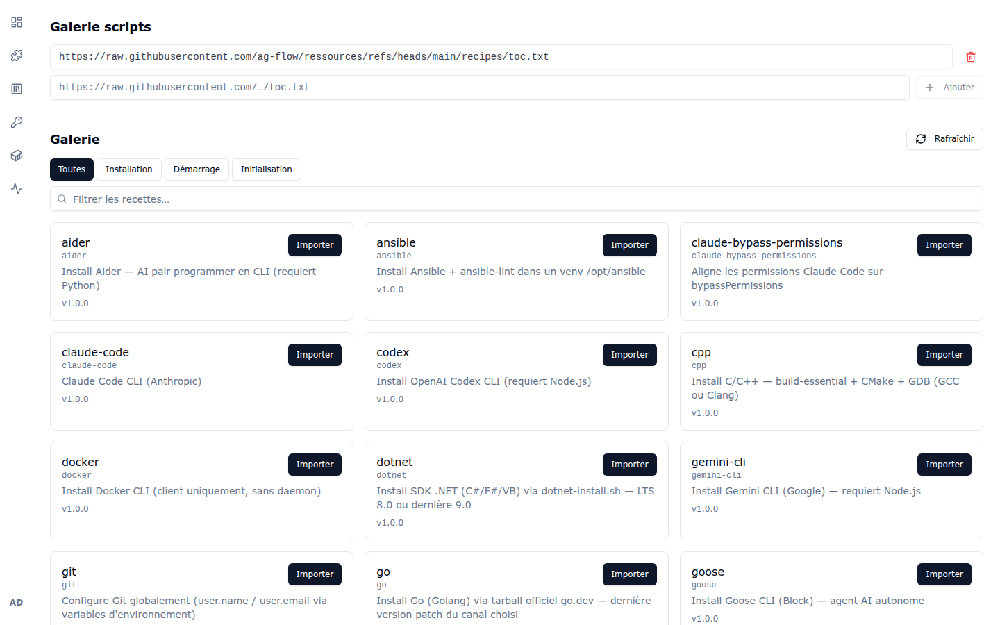

- **Galerie scripts** : les **sources** de la galerie sont des URLs `toc.txt` (une par
  ligne, bouton **+ Ajouter**, corbeille pour retirer). **Rafraîchir** recharge le
  catalogue depuis les sources.
- Les recettes du catalogue se filtrent par type — **Toutes**, **Installation**,
  **Démarrage**, **Initialisation** — et par texte libre.
- **Importer** copie une recette du catalogue vers les recettes partagées du portail,
  visibles ensuite par tous les utilisateurs dans leur page Recettes.

## 6.3 Galerie de profils VS Code

`Menu → Galeries → Profils` :

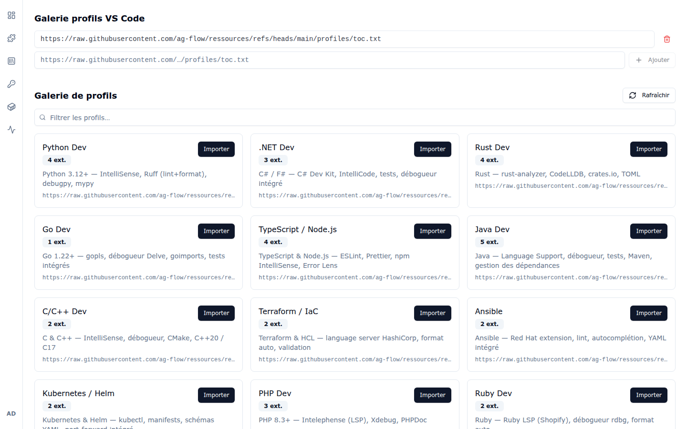

Même principe que la galerie de recettes : des sources `toc.txt`, un catalogue filtrable
(Python Dev, .NET Dev, Rust Dev, Go Dev, TypeScript/Node.js, Java Dev…), chaque carte
indiquant le nombre d'extensions embarquées. **Importer** publie le profil comme profil
partagé.

## 6.4 Hyperviseurs

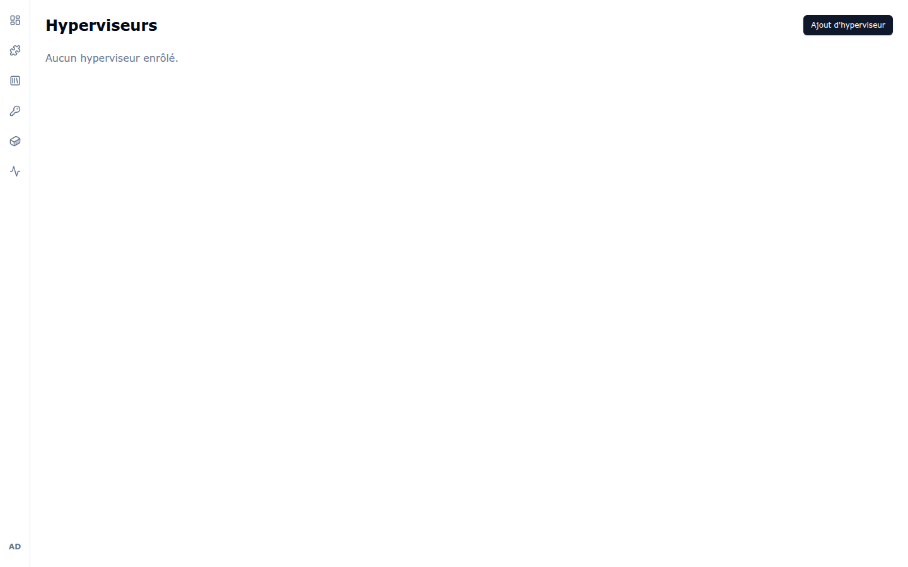

La page **Hyperviseurs** enrôle des hyperviseurs (ex. Proxmox) capables de créer des
machines à la demande (fonction **Generate host** de la page Hôtes Docker).
**Ajout d'hyperviseur** ouvre le formulaire d'enrôlement.

### Types d'hyperviseurs

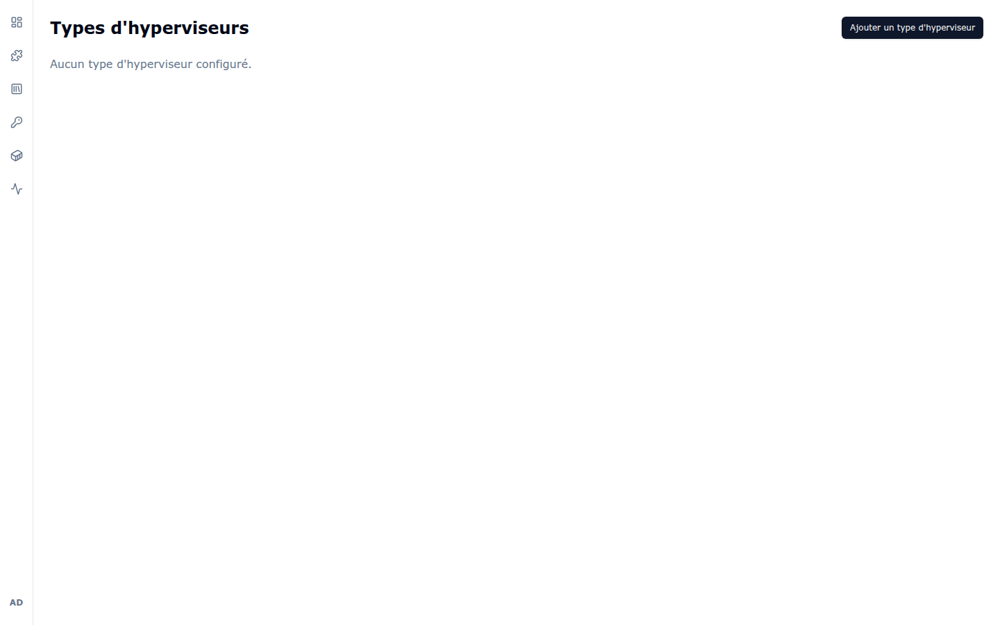

Les **types d'hyperviseurs** décrivent les modèles disponibles (API, paramètres de
provisioning). **Ajouter un type d'hyperviseur** en déclare un nouveau ; les
hyperviseurs enrôlés s'y rattachent.

## 6.5 Templates Compose

`Menu → Galeries → Compose` :

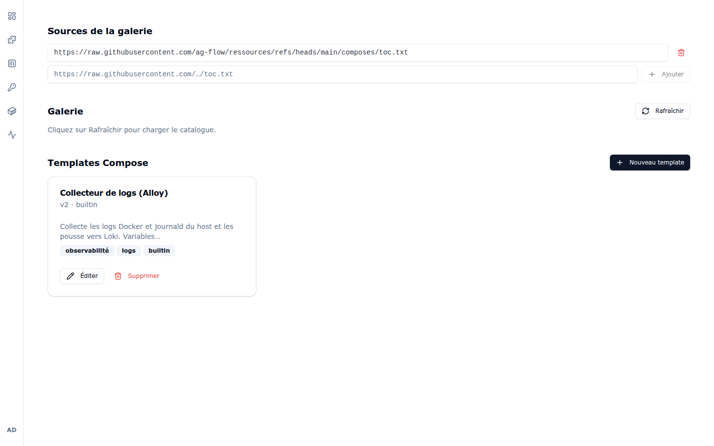

- **Sources de la galerie** : URLs `toc.txt` des catalogues de templates.
- **Galerie** : catalogue distant (**Rafraîchir** pour charger).
- **Templates Compose** : les templates publiés sur le portail. Chaque carte propose
  **Éditer** (YAML du template, variables) et **Supprimer** ; **Nouveau template** crée
  un template de zéro. Les templates `builtin` (ex. « Collecteur de logs (Alloy) »)
  sont fournis avec le portail.

### Templates Jinja2

`Menu → Galeries → Templates Jinja` :

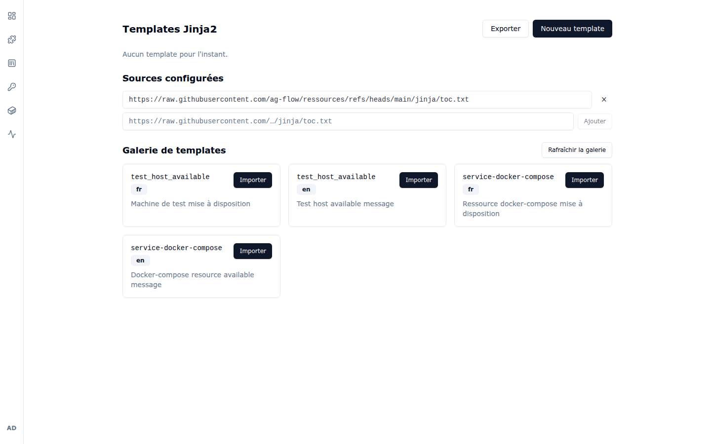

Les **templates Jinja2** servent aux messages générés par le portail (ex. message
« machine de test mise à disposition », « ressource docker-compose mise à disposition »),
en plusieurs langues (`fr`, `en`). Comme les autres galeries : sources configurées,
galerie distante avec **Importer**, et boutons **Nouveau template** / **Exporter**.

## 6.6 Configuration OIDC

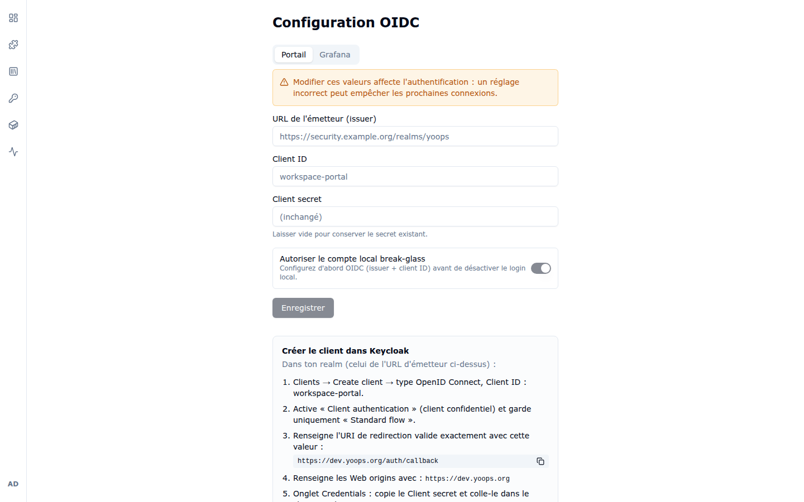

Configure l'authentification SSO (onglet **Portail**) et l'accès Grafana (onglet
**Grafana**) :

- **URL de l'émetteur (issuer)** — ex. `https://security.example.org/realms/yoops` ;
- **Client ID** / **Client secret** — laisser le secret vide conserve l'existant ;
- **Autoriser le compte local break-glass** — maintient un compte local de secours ;
  configurez d'abord OIDC avant de désactiver le login local.

> ⚠️ Le bandeau d'avertissement le rappelle : un réglage incorrect peut empêcher les
> prochaines connexions.

Le panneau **« Créer le client dans Keycloak »** en bas de page donne la procédure pas à
pas côté Keycloak (type de client, URI de redirection à copier, Web origins, récupération
du client secret).

## 6.7 Configuration réseau

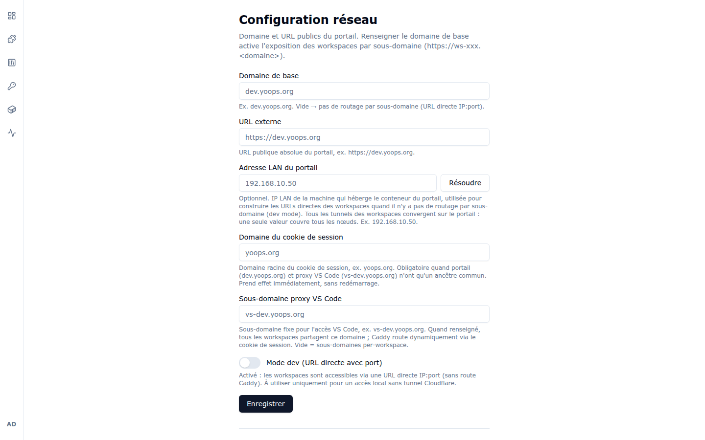

Définit le domaine et les URLs publiques du portail :

- **Domaine de base** — active l'exposition des workspaces par sous-domaine
  (`https://ws-xxx.<domaine>`). Vide = pas de routage par sous-domaine (URL directe
  IP:port).
- **URL externe** — URL publique absolue du portail.
- **Adresse LAN du portail** (+ bouton **Résoudre**) — IP LAN de la machine qui héberge
  le portail, utilisée pour construire les URLs directes des workspaces en mode dev.
- **Domaine du cookie de session** — domaine racine du cookie, obligatoire quand portail
  et proxy VS Code n'ont qu'un ancêtre commun. Prend effet immédiatement.
- **Sous-domaine proxy VS Code** — sous-domaine fixe pour l'accès VS Code
  (ex. `vs-dev.yoops.org`) ; vide = sous-domaines par workspace.
- **Mode dev (URL directe avec port)** — les workspaces sont accessibles en IP:port sans
  route Caddy. À réserver à un accès local sans tunnel Cloudflare.

## 6.8 Logs centralisés

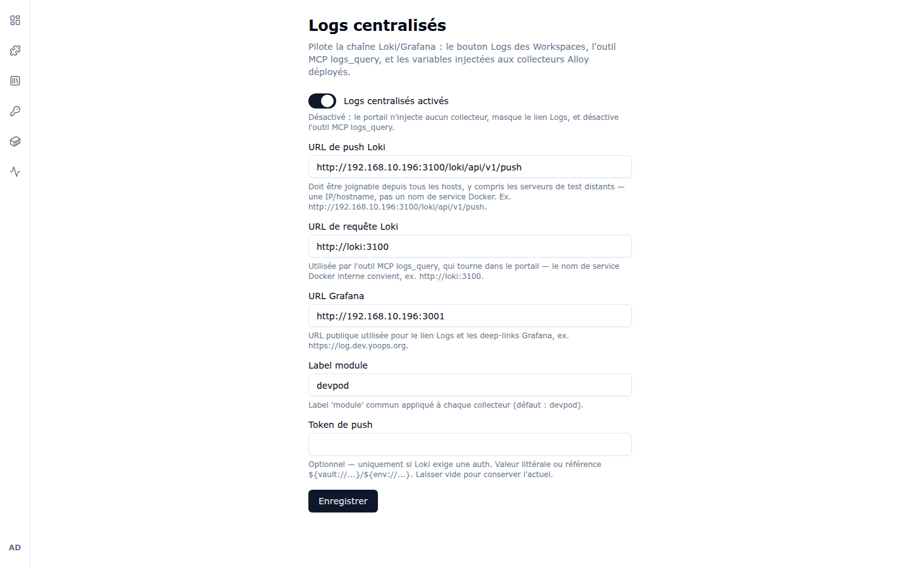

Pilote la chaîne **Loki/Grafana** : le bouton Logs des workspaces, l'outil MCP
`logs_query` et les variables injectées aux collecteurs Alloy déployés.

- **Logs centralisés activés** — désactivé, le portail n'injecte aucun collecteur,
  masque le lien Logs et désactive `logs_query`.
- **URL de push Loki** — doit être joignable depuis **tous** les hosts (IP/hostname
  public, pas un nom de service Docker).
- **URL de requête Loki** — utilisée par l'outil MCP `logs_query` qui tourne dans le
  portail (un nom de service Docker interne convient, ex. `http://loki:3100`).
- **URL Grafana** — URL publique pour le lien Logs et les deep-links Grafana.
- **Label module** — label commun appliqué à chaque collecteur (défaut : `devpod`).
- **Token de push** — optionnel, si Loki exige une authentification ; accepte une valeur
  littérale ou une référence `${vault://...}` / `${env://...}`.

---

Chapitre précédent : [5. Docker Compose](05-docker-compose.md) —
Retour au [sommaire](README.md)
