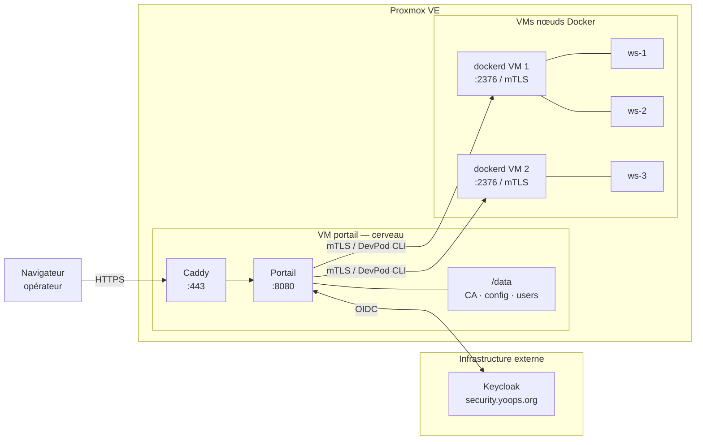

# Déploiement du portail workspace

Ce guide couvre l'installation complète du portail sur sa **VM dédiée** : initialisation de la CA,
configuration, démarrage Docker Compose, et vérification de l'accès.

Une fois le portail démarré et un compte admin disponible dans Keycloak, passer au guide
d'enrôlement des nœuds ([installation-first-node.md](installation-first-node.md)).

---

## Vue d'ensemble

Le portail et les nœuds Docker sont des **machines virtuelles distinctes**. Le portail est
le cerveau (CA, config, authentification) ; les nœuds sont les muscles (là où les workspaces
tournent réellement). Un workspace compromis ne peut pas atteindre la CA ni les secrets du portail.



> **Ce guide ne couvre que la VM portail.** La VM nœud est préparée séparément :
> [preparation-vm-noeud-docker.md](preparation-vm-noeud-docker.md) puis
> [installation-first-node.md](installation-first-node.md).

Le portail ne stocke aucun secret dans son image. Tout — CA, certificats, configuration,
`.env` — vit dans le volume `/data` monté au démarrage.

---

## Script automatisé (recommandé — couvre les étapes 1 à 8)

Un script et un fichier de config permettent de déployer le portail en une commande
depuis Windows, sans se connecter manuellement à la VM.

**Prérequis** : VM Debian 12 créée (via `clone-vm-node.sh`), Docker installé, accès SSH root.

**1 — Créer la VM** sur Proxmox (depuis le host PVE) :
```bash
curl -sSL https://raw.githubusercontent.com/gaelgael5/devpod-ui/refs/heads/main/scripts/clone-vm-node.sh \
  | bash -s -- 110 --name portail-dev --template 9000 --storage vmpool --ip 192.168.1.100/24 --gw 192.168.1.1
```

**2 — Copier et remplir le fichier de config** (depuis le poste Windows) :
```powershell
Copy-Item scripts\.env.portail-dev.remote-deploy.example scripts\.env.portail-dev.remote-deploy
notepad scripts\.env.portail-dev.remote-deploy
```

Renseigner au minimum : `REMOTE_HOST`, `OIDC_CLIENT_SECRET`.

**3 — Lancer le déploiement** :
```powershell
.\scripts\remote-deploy.ps1 portail-dev
```

Le script `deploy-portal.sh` exécuté sur la VM effectue dans l'ordre :
git pull/clone → `install.sh` (CA, config.yaml, .env) → `docker compose build && up -d` → smoke `/health`.

**Si le script suffit, passer directement à l'[Étape suivante — Enrôler les nœuds](#étape-suivante--enrôler-les-nœuds-docker).**
Les étapes 1 à 8 ci-dessous détaillent chaque action pour comprendre, déboguer ou adapter.

---

## Prérequis

| Élément | Détail |
|---|---|
| VM dédiée | Debian 12 recommandé — **pas de LXC** (Docker fragile en LXC) |
| Docker Engine | Installé sur la VM hôte (le portail tourne dans un conteneur) |
| Docker Compose | v2 (`docker compose`) |
| Accès réseau | Port 443 exposé via Cloudflare Tunnel ou directement |
| Keycloak | Instance `security.yoops.org`, realm `yoops` accessible |
| Dépôt | Accès en lecture à `gaelgael5/devpod-ui` (clone ou téléchargement) |

---

## Étape 1 — Installer Docker sur la VM hôte

Si Docker n'est pas encore présent :

```bash
apt-get update
apt-get install -y ca-certificates curl gnupg

install -m 0755 -d /etc/apt/keyrings
curl -fsSL https://download.docker.com/linux/debian/gpg \
    | gpg --dearmor -o /etc/apt/keyrings/docker.gpg

echo "deb [arch=$(dpkg --print-architecture) signed-by=/etc/apt/keyrings/docker.gpg] \
    https://download.docker.com/linux/debian \
    $(. /etc/os-release && echo "$VERSION_CODENAME") stable" \
    > /etc/apt/sources.list.d/docker.list

apt-get update
apt-get install -y docker-ce docker-ce-cli containerd.io docker-compose-plugin
```

Vérification :
```bash
docker version --format '{{.Server.Version}}'
docker compose version
```

---

## Étape 2 — Récupérer le code

```bash
cd /opt
git clone https://github.com/gaelgael5/devpod-ui.git workspace-portal
cd workspace-portal
```

---

## Étape 3 — Initialiser /data avec install.sh

`install.sh` est **idempotent** : sans danger à ré-exécuter. Il crée ou ignore chaque élément
selon sa présence. Il ne régénère **jamais** la CA si elle existe déjà (§E-25).

```bash
sudo bash scripts/install.sh
```

Le script demande interactivement trois valeurs (ou les lit depuis des variables d'env) :

| Variable | Prompt | Défaut |
|---|---|---|
| `PORTAL_BASE_DOMAIN` | Base domain | `dev.yoops.org` |
| `PORTAL_EXTERNAL_URL` | External URL | `https://dev.yoops.org` |
| `PORTAL_OIDC_ISSUER` | OIDC issuer URL | `https://security.yoops.org/realms/yoops` |
| `PORTAL_OIDC_CLIENT_ID` | OIDC client ID | `workspace-portal` |

Pour un déploiement non interactif (CI, script d'infra) :
```bash
PORTAL_BASE_DOMAIN=dev.yoops.org \
PORTAL_OIDC_ISSUER=https://security.yoops.org/realms/yoops \
PORTAL_OIDC_CLIENT_ID=workspace-portal \
  sudo bash scripts/install.sh
```

**Ce que le script crée dans `/data` :**

```
/data/
├── certs/
│   ├── ca/
│   │   ├── ca.pem          ← CA racine de confiance mTLS  (créée une fois, §E-25)
│   │   └── ca-key.pem      ← Clé privée de la CA          (600 — ne quitte jamais /data)
│   ├── portal/
│   │   ├── ca.pem          ← Copie de la CA (lu par devpod)
│   │   ├── cert.pem        ← Cert client que le portail présente aux daemons Docker
│   │   └── key.pem         ← Clé privée du cert client    (600)
│   └── nodes/              ← Certs serveurs des nœuds enrôlés (rempli lors des enrôlements)
├── users/                  ← Configs par utilisateur (créées au premier login)
├── routes/                 ← Table de routage Caddy (gérée par le portail)
├── config.yaml             ← Configuration principale (à compléter — étape 4)
└── .env                    ← Variables secrètes       (à compléter — étape 5, perms 600)
```

À la fin, le script affiche l'empreinte SHA-256 de la CA :
```
Empreinte CA : SHA256:AB:12:CD:...
```

**Conserver cette empreinte** — elle permet de vérifier l'intégrité de la CA lors des futures
opérations de maintenance.

---

## Étape 4 — Compléter /data/config.yaml

`install.sh` a généré un `config.yaml` avec les valeurs saisies. Vérifier et ajuster si nécessaire :

```bash
nano /data/config.yaml
```

Les champs qui nécessitent une attention particulière :

```yaml
server:
  base_domain: "dev.yoops.org"       # domaine wildcard des workspaces
  external_url: "https://dev.yoops.org"

auth:
  oidc:
    issuer: "https://security.yoops.org/realms/yoops"
    client_id: "workspace-portal"
    client_secret: "${env://OIDC_CLIENT_SECRET}"   # rempli dans .env

caddy:
  admin_api: "http://caddy:2019"     # laisser tel quel (réseau interne compose)
```

Les champs `hosts:` resteront vides (`hosts: []`) jusqu'au premier enrôlement de nœud.

---

## Étape 5 — Compléter /data/.env

```bash
nano /data/.env
```

Contenu type généré par `install.sh` :

```dotenv
SESSION_SECRET_KEY=<généré automatiquement — ne pas modifier>
OIDC_CLIENT_SECRET=          ← À remplir (secret du client Keycloak — étape 6)
HARPOCRATE_API_KEY=          ← Laisser vide si backend "inline" suffisant
CFM_API_KEY=                 ← Clé API cloudflare-manager (si exposé via Cloudflare Tunnel)
CF_API_TOKEN=                ← Token Cloudflare pour DNS-01 (renouvellement TLS wildcard)
ACME_EMAIL=                  ← Email pour les notifications ACME/Let's Encrypt
BASE_DOMAIN=dev.yoops.org
```

`SESSION_SECRET_KEY` est généré aléatoirement par `install.sh` — ne jamais l'écraser.
`OIDC_CLIENT_SECRET` est la seule valeur bloquante : sans elle, toute tentative de connexion
échoue avec une erreur 401.

```bash
chmod 600 /data/.env   # vérifier les permissions — le script les pose, mais s'assurer
```

---

## Étape 6 — Configurer Keycloak

Ces actions s'effectuent dans la console d'administration Keycloak
(`https://security.yoops.org/admin`), dans le realm **yoops**.

### 6.1 — Créer les rôles realm

Dans **Realm roles → Create role** :

| Nom du rôle | Description |
|---|---|
| `admin` | Accès complet : gestion des nœuds, tokens d'enrôlement, recipes |
| `dev` | Accès utilisateur : gérer ses propres workspaces |

### 6.2 — Créer le client OIDC

Dans **Clients → Create client** :

| Champ | Valeur |
|---|---|
| Client type | `OpenID Connect` |
| Client ID | `workspace-portal` |
| Name | `Workspace Portal` |

Page suivante (**Capability config**) :

| Champ | Valeur |
|---|---|
| Client authentication | `On` (client confidentiel — expose un secret) |
| Authorization | `Off` |
| Authentication flow | `Standard flow` coché uniquement |

Page suivante (**Login settings**) :

| Champ | Valeur |
|---|---|
| Root URL | `https://dev.yoops.org` |
| Valid redirect URIs | `https://dev.yoops.org/auth/callback` |
| Valid post logout redirect URIs | `https://dev.yoops.org/` |
| Web origins | `https://dev.yoops.org` |

Après création, aller dans l'onglet **Credentials** et copier le **Client secret** :
c'est la valeur à placer dans `OIDC_CLIENT_SECRET` du `.env`.

### 6.3 — Mapper les rôles realm dans le token

Par défaut Keycloak inclut les rôles realm dans le claim `realm_access.roles`, ce qui
correspond à la configuration `role_claim: "realm_access.roles"` dans `config.yaml`.
Aucun mapper supplémentaire n'est nécessaire.

### 6.4 — Créer un utilisateur admin

Dans **Users → Create new user** :

| Champ | Valeur |
|---|---|
| Username | `admin` (ou nom souhaité) |
| Email | email de l'opérateur |
| Email verified | `On` |

Onglet **Credentials** → **Set password** (désactiver "Temporary").

Onglet **Role mappings** → **Assign role** → filtrer sur `admin` → assigner.

---

## Étape 7 — Démarrer le portail

```bash
cd /opt/workspace-portal
docker compose -f deploy/docker-compose.yml up -d
```

Suivre le démarrage :
```bash
docker compose -f deploy/docker-compose.yml logs -f portal
```

Attendre la ligne :
```
{"event": "startup_complete", "host": "0.0.0.0", "port": 8080}
```

---

## Étape 8 — Vérifications

### Health check interne

```bash
docker compose -f deploy/docker-compose.yml exec portal \
    curl -sf http://localhost:8080/health && echo "OK"
```

### Accès HTTPS

Ouvrir `https://dev.yoops.org` dans un navigateur.
Le portail redirige vers Keycloak. Se connecter avec le compte admin créé à l'étape 6.4.
Après authentification, la page d'accueil du portail doit s'afficher.

### Empreinte CA

```bash
# Vérifier que la CA n'a pas changé depuis l'initialisation
openssl x509 -in /data/certs/ca/ca.pem -noout -fingerprint -sha256
```

Comparer avec l'empreinte affichée par `install.sh` à l'étape 3.

### Vérification des permissions

```bash
stat -c "%n %a" /data/.env /data/certs/ca/ca-key.pem /data/certs/portal/key.pem
# attendu : 600 sur chacun
```

---

## Étape suivante — Enrôler les nœuds Docker

Le portail est opérationnel. Pour lui connecter un premier nœud Docker :

→ [installation-first-node.md](installation-first-node.md)

L'admin se connecte au portail, génère un join token via l'interface (ou `POST /admin/nodes/token`),
puis exécute le script d'enrôlement sur la VM nœud.

---

## Dépannage

### Le portail ne démarre pas — `SESSION_SECRET_KEY not set`

```bash
docker compose -f deploy/docker-compose.yml logs portal | grep -i session
```

Vérifier que `/data/.env` est monté et contient `SESSION_SECRET_KEY` :
```bash
docker compose -f deploy/docker-compose.yml exec portal env | grep SESSION
```

### Erreur OIDC — `invalid_client` ou `401`

`OIDC_CLIENT_SECRET` absent ou incorrect dans `/data/.env`. Récupérer le bon secret
depuis **Keycloak → Clients → workspace-portal → Credentials**.

### Erreur OIDC — `redirect_uri_mismatch`

L'URL de callback ne correspond pas. Vérifier que `https://dev.yoops.org/auth/callback`
est bien dans **Valid redirect URIs** du client Keycloak.

### La CA est absente après un redémarrage

Le volume `/data` n'est pas persistant ou a été supprimé. Vérifier le montage :
```bash
docker compose -f deploy/docker-compose.yml exec portal ls /data/certs/ca/
```

Si `/data` est vide, `install.sh` peut être ré-exécuté — il régénèrera la CA.
**Attention :** une nouvelle CA invalide tous les certificats de nœuds déjà enrôlés —
ceux-ci devront être ré-enrôlés.

### Caddy ne renouvelle pas le certificat wildcard

Vérifier que `CF_API_TOKEN` est renseigné dans `.env` et que le token Cloudflare a
le droit `Zone:DNS:Edit` sur le domaine `yoops.org`.

```bash
docker compose -f deploy/docker-compose.yml logs caddy | grep -i acme
```
