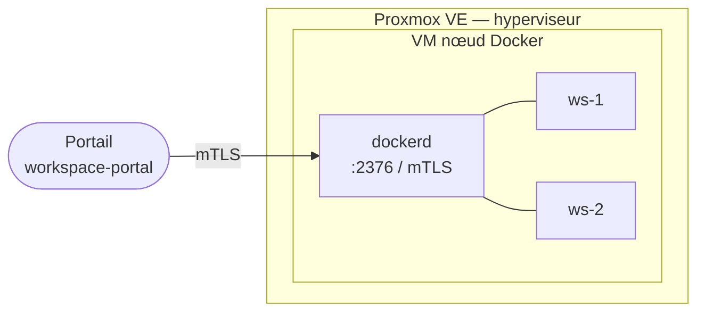

# Préparation d'une VM nœud Docker

Ce guide couvre la création et la configuration d'une machine virtuelle destinée à accueillir
des conteneurs de workspaces. Une fois la VM prête, le guide d'enrôlement
([installation-first-node.md](installation-first-node.md)) prend le relais.

Un nœud n'héberge rien de propriétaire : c'est un daemon Docker standard exposé en mTLS sur
le port 2376. Le portail s'y connecte via DevPod ; aucun agent permanent n'y est installé.

---

## Vue d'ensemble



Chaque workspace est un conteneur Docker lancé par DevPod. La VM n'a pas besoin
de ressources excessives au départ — elle peut être redimensionnée sans réenrôlement.

---

## Prérequis

| Élément | Valeur recommandée |
|---|---|
| Hyperviseur | Proxmox VE 7.x ou 8.x |
| OS guest | Debian 12 (Bookworm) — LTS, support Docker officiel |
| CPU | 4 vCPU minimum (8 pour usage intensif) |
| RAM | 8 Go minimum (16 Go recommandés) |
| Disque | 80 Go minimum (SSD de préférence — les pulls d'images sont I/O-bound) |
| Réseau | IP fixe, joignable depuis le serveur hébergeant le portail |
| Accès | root ou sudo pendant l'installation |

> **Pas de LXC.** Docker-in-LXC est fragile (namespaces imbriqués, cgroups v2 partiels).
> Utiliser exclusivement des VMs KVM/QEMU sur Proxmox.

---

## Deux chemins possibles

| Situation | Chemin |
|---|---|
| Un template cloud-init existe déjà sur le cluster (VMID connu) | **Chemin A — Cloner le template** (recommandé, plus rapide) |
| Pas de template disponible, installation depuis zéro | **Chemin B — Installation depuis ISO** |

Les deux chemins convergent à l'**Étape 3** (configuration post-installation commune).

Si aucun template n'existe encore, créer le template de référence une première fois
(opération unique par cluster) avant d'utiliser le Chemin A.

---

## Créer le template de référence (opération unique)

Un template Proxmox est une VM non démarrable qui sert de base à tous les clones futurs.
On le crée une seule fois par cluster ; chaque nouveau nœud Docker est ensuite cloné
en quelques secondes depuis ce template plutôt que réinstallé depuis un ISO.

Le principe : télécharger une image cloud officielle Debian 12 (disque pré-installé, prêt
à démarrer), l'importer dans Proxmox, configurer la VM, puis la figer en template.

Toutes les commandes suivantes s'exécutent **en root sur le host Proxmox** (SSH sur le nœud PVE,
pas dans une VM).

### Script automatisé (recommandé — couvre T.1 à T.9)

Un script automatise l'intégralité des étapes T.1 à T.9 : détection du stockage,
vérification du VMID, téléchargement de l'image + contrôle SHA512, création de la VM,
import du disque, configuration cloud-init et conversion en template.
Fournir uniquement le VMID :

```bash
# Depuis le host PVE — en root
curl -sSL https://raw.githubusercontent.com/gaelgael5/devpod-ui/refs/heads/main/scripts/create-vm-generic.sh \
  | bash -s -- 9000
```

Avec options (stockage, bridge, nom, ressources) :

```bash
curl -sSL https://raw.githubusercontent.com/gaelgael5/devpod-ui/refs/heads/main/scripts/create-vm-generic.sh \
  | bash -s -- 9000 --name debian12-template --storage local-lvm --bridge vmbr0 --cores 2 --memory 2048
```

Si le script est déjà présent localement :
```bash
bash scripts/create-vm-generic.sh 9000
```

Le script s'arrête avec un message d'erreur explicite si le VMID est déjà occupé,
que ce soit par une VM, un template ou un conteneur LXC.

**Si la commande `curl | bash` suffit, passer directement au [Chemin A](#chemin-a--cloner-un-template-existant).**
Les étapes T.1 à T.9 ci-dessous détaillent chaque action — utiles pour comprendre,
déboguer ou adapter à un environnement spécifique.

---

### T.1 — Vérifier le stockage disponible

```bash
# Lister les stockages Proxmox et leur type
pvesm status
```

Exemple de sortie :
```
Name         Type     Status           Total            Used       Available        %
local        dir      active        95878144        11493376        84384768   12.00%
local-lvm    lvmthin  active       204800000        12345678       192454322    6.03%
```

Le stockage cible pour les disques de VM est généralement `local-lvm` (LVM-thin, performant)
ou `local-zfs` (ZFS). Repérer le nom exact — il sera utilisé dans les commandes suivantes.
Si seul `local` (répertoire) est disponible, utiliser `local` à la place de `local-lvm`.

### T.2 — Télécharger l'image cloud Debian 12

```bash
cd /tmp
wget https://cloud.debian.org/images/cloud/bookworm/latest/debian-12-genericcloud-amd64.qcow2
```

L'image `genericcloud` est optimisée pour les environnements virtualisés : noyau minimal,
cloud-init pré-installé, qemu-guest-agent absent (installé à l'étape T.6).
Taille typique : ~350 Mo.

Vérifier l'intégrité (optionnel mais recommandé) :
```bash
wget https://cloud.debian.org/images/cloud/bookworm/latest/SHA512SUMS
sha512sum --check --ignore-missing SHA512SUMS
# attendu : debian-12-genericcloud-amd64.qcow2: OK
```

### T.3 — Choisir un VMID libre pour le template

Par convention, les templates Proxmox utilisent des VMID élevés (9000+) pour les distinguer
des VMs actives. Vérifier que le VMID choisi est libre :

```bash
qm list | awk '{print $1}' | grep -x 9000 && echo "VMID 9000 occupé" || echo "VMID 9000 libre"
```

### T.4 — Créer la VM vide

```bash
qm create 9000 \
  --name debian12-template \
  --memory 2048 \
  --cores 2 \
  --net0 virtio,bridge=vmbr0 \
  --ostype l26 \
  --machine q35 \
  --agent enabled=1 \
  --serial0 socket \
  --vga serial0
```

| Paramètre | Rôle |
|---|---|
| `9000` | VMID du template (libre, ajustable) |
| `--name debian12-template` | Nom affiché dans l'interface Proxmox |
| `--memory 2048 --cores 2` | Ressources minimales pour le template — les clones seront redimensionnés |
| `--net0 virtio,bridge=vmbr0` | Carte réseau VirtIO sur le bridge principal ; ajuster `vmbr0` si le réseau utilise un autre bridge |
| `--ostype l26` | Linux 2.6+ — active les optimisations Proxmox pour Linux |
| `--machine q35` | Chipset Q35 moderne, requis pour certains pilotes VirtIO récents |
| `--agent enabled=1` | Active le support qemu-guest-agent (installé à l'étape T.6) |
| `--serial0 socket --vga serial0` | Redirige la sortie console vers le port série virtuel ; sans cela, la console Proxmox reste noire pour les images cloud Debian (elles écrivent sur ttyS0, pas sur VGA) |

### T.5 — Importer et attacher le disque cloud

```bash
# Importer l'image qcow2 dans le stockage Proxmox
# Remplacer local-lvm par le nom de stockage identifié à l'étape T.1
qm importdisk 9000 /tmp/debian-12-genericcloud-amd64.qcow2 local-lvm
```

La commande affiche le chemin exact du disque créé :
```
Successfully imported disk as 'local-lvm:vm-9000-disk-0'
```

Attacher ce disque à la VM :
```bash
qm set 9000 --scsihw virtio-scsi-pci --scsi0 local-lvm:vm-9000-disk-0,discard=on
```

| Paramètre | Rôle |
|---|---|
| `--scsihw virtio-scsi-pci` | Contrôleur SCSI VirtIO — meilleures performances que le contrôleur par défaut |
| `--scsi0 ...` | Attache le disque importé comme premier disque SCSI |
| `discard=on` | Transmet les commandes TRIM/DISCARD du guest au stockage — libère l'espace réellement inutilisé dans LVM-thin |

### T.6 — Ajouter le lecteur cloud-init

Cloud-init est le mécanisme qui injecte hostname, IP, clés SSH et commandes de démarrage
dans la VM à son premier boot. Sans lecteur cloud-init attaché, les `qm set --ipconfig0`
et `--sshkey` des étapes A.3 et A.6 n'ont aucun effet.

```bash
# Le lecteur cloud-init est un disque virtuel léger stocké sur le même stockage
qm set 9000 --ide2 local-lvm:cloudinit
```

### T.7 — Configurer le démarrage et la console

```bash
# Démarrer depuis scsi0 (le disque importé)
qm set 9000 --boot order=scsi0

# Activer la console série (cohérent avec --serial0 socket défini à l'étape T.4)
qm set 9000 --vga serial0
```

### T.8 — Démarrer la VM une fois pour installer qemu-guest-agent

L'image cloud Debian 12 n'inclut pas `qemu-guest-agent` par défaut. Ce paquet est nécessaire
pour que `qm guest exec` fonctionne (récupération d'IP, diagnostics depuis le host PVE).

Démarrer la VM temporairement et se connecter via la console Proxmox :

```bash
# Injecter une clé SSH et une IP temporaire avant le premier démarrage
qm set 9000 --sshkey ~/.ssh/id_ed25519.pub
qm set 9000 --ipconfig0 ip=dhcp

# Démarrer
qm start 9000
```

Attendre 30 secondes, puis se connecter (l'image cloud Debian utilise l'utilisateur `debian`) :

```bash
# Récupérer l'IP attribuée via la console Proxmox ou les logs DHCP du routeur
# Puis :
ssh debian@<IP_TEMPORAIRE>
sudo apt-get install -y qemu-guest-agent
sudo systemctl enable --now qemu-guest-agent

# Nettoyer cloud-init pour qu'il se ré-exécute proprement sur chaque clone
sudo cloud-init clean --logs
sudo truncate -s 0 /etc/machine-id
sudo sync

# Éteindre proprement
sudo poweroff
```

### T.9 — Convertir en template

```bash
qm template 9000
```

La VM est maintenant marquée comme template : elle n'est plus démarrable directement
mais peut être clonée un nombre illimité de fois.

Vérification :
```bash
qm list | grep 9000
# attendu : 9000  debian12-template  stopped  (avec le symbole template dans l'interface web)
```

Nettoyer l'image temporaire :
```bash
rm /tmp/debian-12-genericcloud-amd64.qcow2
```

Le template est prêt. Passer au **Chemin A** pour créer les nœuds Docker.

---

## Chemin A — Cloner un template existant

Ce chemin suppose qu'une VM template Proxmox existe (par exemple au VMID `9000`).
Un template Proxmox est une VM marquée comme modèle (non démarrable directement) depuis laquelle
on peut créer des copies. Les templates cloud-init incluent un lecteur `cloudinit` qui permet
d'injecter hostname, IP et clés SSH sans passer par un installateur.

### Script automatisé (recommandé — couvre A.1 à A.11)

Un script automatise l'intégralité des étapes A.1 à A.11 : vérification du VMID,
clone complet du template, redimensionnement du disque, injection de clé SSH,
configuration réseau cloud-init, démarrage, attente SSH et configuration du hostname.

Paramètres obligatoires : le VMID de la nouvelle VM, son nom, son IP fixe avec masque et
la passerelle. Le VMID du template source est détecté automatiquement (premier template trouvé)
ou peut être précisé via `--template`.

```bash
# Depuis le host PVE — en root
curl -sSL https://raw.githubusercontent.com/gaelgael5/devpod-ui/refs/heads/main/scripts/clone-vm-node.sh \
  | bash -s -- 104 --name pve2-docker --ip 192.168.1.50/24 --gw 192.168.1.1
```

Avec toutes les options :

```bash
curl -sSL https://raw.githubusercontent.com/gaelgael5/devpod-ui/refs/heads/main/scripts/clone-vm-node.sh \
  | bash -s -- 104 \
      --name    pve2-docker \
      --ip      192.168.1.50/24 \
      --gw      192.168.1.1 \
      --template 9000 \
      --dns     1.1.1.1 \
      --memory  8192 \
      --cores   4 \
      --disk    +40G \
      --sshkey  /tmp/operator.pub \
      --ciuser  debian
```

| Option | Défaut | Description |
|---|---|---|
| `<NEW_VMID>` | — | **Obligatoire** — VMID de la nouvelle VM (entier positif libre) |
| `--name NOM` | — | **Obligatoire** — nom DNS-safe de la VM (`pve2-docker`, `node-gpu-01`…) |
| `--ip IP/CIDR` | — | **Obligatoire** — adresse IP fixe avec masque (`192.168.1.50/24`) |
| `--gw IP` | — | **Obligatoire** — passerelle réseau |
| `--template VMID` | auto-détecté | VMID du template source (premier template trouvé si omis) |
| `--dns IP` | `1.1.1.1` | Serveur DNS injecté via cloud-init |
| `--memory Mo` | `8192` | RAM allouée en Mo |
| `--cores N` | `4` | Nombre de vCPU |
| `--disk TAILLE` | `+40G` | Extension du disque principal avant le premier démarrage (`+40G`, `+80G`…) |
| `--sshkey CHEMIN` | auto-détecté | Chemin de la clé publique SSH à injecter (cherche `~/.ssh/id_*.pub` si omis) |
| `--ciuser NOM` | `debian` | Utilisateur cloud-init créé par le template |

Si le VMID est déjà occupé — par une VM, un template ou un conteneur LXC — le script
s'arrête avec un message d'erreur explicite.

**Si la commande `curl | bash` suffit, passer directement à l'[Étape 3](#étape-3--configuration-post-installation).**
Les étapes A.1 à A.11 ci-dessous détaillent chaque action — utiles pour comprendre,
déboguer ou adapter à un environnement spécifique.

---

### A.1 — Vérifier le VMID source et choisir un VMID libre

Depuis le **shell de l'hôte Proxmox** (SSH sur le nœud PVE, pas dans une VM) :

```bash
# Lister les VMs et templates existants pour identifier les VMID occupés
qm list

# Résultat exemple :
#  VMID NAME              STATUS     MEM(MB)    BOOTDISK(GB) PID
#  9000 debian12-template stopped    2048       10.00        0
#  100  portail           running    4096       40.00        12345
#  101  pve2-docker       running    8192       80.00        23456
```

Choisir un VMID libre dans la plage configurée du cluster (généralement 100–999 ou 100–9999).
Dans l'exemple ci-dessus, `104` est libre.

### A.2 — Cloner le template

```bash
# Depuis le host PVE — choisis un VMID libre (ex. 104) et un nom DNS-safe
qm clone 9000 104 --name devhost --full
```

| Paramètre | Rôle |
|---|---|
| `9000` | VMID du template source |
| `104` | VMID de la nouvelle VM (doit être libre) |
| `--name devhost` | Nom affiché dans Proxmox — utiliser un nom DNS-safe (`pve2-docker`, `node-gpu-01`…) |
| `--full` | Clone complet : copie intégrale du disque, indépendante du template. Sans ce flag, un clone lié (*linked clone*) partage les blocs du template — il est plus rapide à créer mais ne peut pas être migré sur un autre stockage ni supprimé sans supprimer le template. Pour un nœud de production, toujours utiliser `--full`. |

La commande peut prendre 1 à 5 minutes selon la taille du disque source et le type de stockage.

### A.3 — Préparer et injecter la clé SSH de l'opérateur

#### De quelle clé s'agit-il ?

Il s'agit de la **clé SSH du poste de travail de l'opérateur** (la personne qui administre
les nœuds), pas de la clé du host Proxmox. La clé privée reste sur le poste de l'opérateur ;
seule la clé publique est injectée dans la VM via cloud-init. Une fois la VM démarrée,
l'opérateur pourra s'y connecter directement (`ssh root@192.168.1.50`) depuis son poste
sans mot de passe.

```
Poste opérateur          Host PVE             VM nœud Docker
┌─────────────┐          ┌──────────┐         ┌──────────────┐
│ clé privée  │──SSH──►  │          │         │ authorized_  │
│ id_ed25519  │          │ qm set   │────────►│ keys         │
│ id_ed25519  │  (copy)  │ --sshkey │  cloud- │ (clé publique│
│ .pub        │─────────►│          │  init   │  de l'opér.) │
└─────────────┘          └──────────┘         └──────────────┘
```

#### Étape 1 — Vérifier ou créer la paire de clés (sur le poste de l'opérateur)

---

**Sous Windows (PowerShell)**

Vérifier si une clé existe déjà :
```powershell
Test-Path "$env:USERPROFILE\.ssh\id_ed25519.pub"
# True  → la clé existe, passer à l'Étape 2
# False → générer une nouvelle clé ci-dessous
```

Si la clé n'existe pas, la générer :
```powershell
# Ouvrir PowerShell (pas besoin d'être administrateur)
ssh-keygen -t ed25519 -C "operateur@mon-poste"
```

L'outil pose trois questions :
```
Enter file in which to save the key (C:\Users\<user>/.ssh/id_ed25519): [Entrée — chemin par défaut]
Enter passphrase (empty for no passphrase): [passphrase recommandée ou Entrée]
Enter same passphrase again: [répéter]
```

Afficher la clé publique générée :
```powershell
Get-Content "$env:USERPROFILE\.ssh\id_ed25519.pub"
# exemple de sortie :
# ssh-ed25519 AAAAC3NzaC1lZDI1NTE5AAAA... operateur@mon-poste
```

---

**Sous Linux / macOS**

Vérifier si une clé existe déjà :
```bash
ls -la ~/.ssh/id_ed25519.pub
# si le fichier existe → passer à l'Étape 2
# si "No such file" → générer une nouvelle clé ci-dessous
```

Si la clé n'existe pas, la générer :
```bash
ssh-keygen -t ed25519 -C "operateur@mon-poste"
# Répondre aux mêmes trois questions qu'en Windows
```

Afficher la clé publique :
```bash
cat ~/.ssh/id_ed25519.pub
# ssh-ed25519 AAAAC3NzaC1lZDI1NTE5AAAA... operateur@mon-poste
```

---

#### Étape 2 — Copier la clé publique sur le host PVE

La commande `qm set --sshkey` attend un **chemin de fichier sur le host PVE**.
Il faut donc transférer la clé publique du poste de l'opérateur vers le host Proxmox
avant d'exécuter la commande.

---

**Depuis Windows**

```powershell
# scp est disponible nativement depuis Windows 10 1803+
scp "$env:USERPROFILE\.ssh\id_ed25519.pub" root@<IP_PVE>:/tmp/operator.pub
```

Si `scp` n'est pas disponible (Windows plus ancien) :
```powershell
# Afficher la clé, copier la ligne complète dans le presse-papier
Get-Content "$env:USERPROFILE\.ssh\id_ed25519.pub" | clip

# Puis sur le host PVE (via la console web Proxmox ou une session SSH existante) :
# nano /tmp/operator.pub  → coller → Ctrl+O → Ctrl+X
```

---

**Depuis Linux / macOS**

```bash
scp ~/.ssh/id_ed25519.pub root@<IP_PVE>:/tmp/operator.pub
```

Remplacer `<IP_PVE>` par l'adresse IP du nœud Proxmox (pas de la VM).

---

#### Étape 3 — Injecter la clé dans la VM via cloud-init

Depuis le shell du host PVE (connexion SSH ou console Proxmox) :

```bash
qm set 104 --sshkey /tmp/operator.pub

# Nettoyer après injection
rm /tmp/operator.pub
```

**Cas particulier — si l'opérateur se connecte déjà au host PVE avec sa clé**

La clé publique de l'opérateur est alors présente dans `/root/.ssh/authorized_keys` sur PVE.
Il est possible de l'extraire directement sans transfert :

```bash
# Sur le host PVE — extraire la clé de l'opérateur et l'injecter dans la VM
# (adapter le pattern si authorized_keys contient plusieurs entrées)
grep "operateur@" /root/.ssh/authorized_keys > /tmp/operator.pub
qm set 104 --sshkey /tmp/operator.pub
rm /tmp/operator.pub
```

---

Sans cette étape, l'accès initial passe par la console Proxmox ou par le mot de passe par défaut
du template (généralement documenté par celui qui l'a créé).

### A.4 — Configurer la mémoire et le CPU

```bash
qm set 104 --memory 8192 --cores 4
```

| Paramètre | Valeur | Remarque |
|---|---|---|
| `--memory 8192` | 8 Go de RAM | Minimum pour un nœud Docker actif |
| `--cores 4` | 4 vCPU | Augmenter si les builds devcontainer sont lents |

Ces valeurs peuvent être modifiées après coup sans réenrôlement (redémarrage requis).

### A.5 — Agrandir le disque avant le premier démarrage

> Effectuer le resize **avant** de démarrer la VM. Cloud-init détecte et étend la partition
> automatiquement au premier boot si le disque a été agrandi à froid.
> Après le premier démarrage, l'extension est toujours possible mais nécessite des opérations
> manuelles sur les partitions (voir section [Redimensionnement en ligne](#redimensionnement-en-ligne-proxmox)).

```bash
# +40G sur le disque principal (scsi0 — vérifier avec : qm config 104 | grep scsi)
qm resize 104 scsi0 +40G
```

Vérifier le nom du bus et du disque cible :
```bash
qm config 104 | grep -E '^(scsi|virtio|sata|ide)[0-9]'
# exemple de sortie : scsi0: local-lvm:vm-104-disk-0,size=50G
```

Si le disque est `virtio0` au lieu de `scsi0`, adapter la commande en conséquence.

### A.6 — Configurer l'adresse IP via cloud-init

#### Option 1 — DHCP (pour démarrage rapide, à convertir en IP fixe ensuite)

```bash
qm set 104 --ipconfig0 ip=dhcp
```

L'interface réseau de la VM obtiendra une IP automatiquement via DHCP au premier démarrage.
Cette option est utile si l'IP définitive n'est pas encore choisie, mais **un nœud Docker
doit avoir une IP fixe** — le SAN du certificat est lié à cette adresse.

#### Option 2 — IP fixe dès le départ (recommandé)

```bash
qm set 104 --ipconfig0 ip=192.168.1.50/24,gw=192.168.1.1 --nameserver 1.1.1.1
```

Remplacer `192.168.1.50` par une IP libre de la plage réseau.
Cette IP sera celle déclarée lors de la génération du join token (`--address 192.168.1.50`).

### A.7 — Démarrer la VM

```bash
qm start 104
```

Suivre le démarrage depuis la console Proxmox (**VM 104 → Console**) ou attendre 30 secondes
avant de tenter la connexion SSH.

### A.8 — Trouver l'IP (si DHCP)

Si l'option DHCP a été choisie à l'étape A.6, récupérer l'IP attribuée :

```bash
# Depuis le host PVE — nécessite que qemu-guest-agent soit installé dans le template
qm guest exec 104 -- ip -4 addr show | grep inet

# Ou depuis l'interface Proxmox : VM 104 → Summary → IP Addresses
```

Si `qemu-guest-agent` n'est pas disponible, ouvrir la console Proxmox et lire l'IP directement.

### A.9 — Se connecter en SSH

```bash
# Avec la clé injectée à l'étape A.3
ssh root@192.168.1.50

# Si le template utilise un utilisateur non-root (ex. debian, admin)
ssh debian@192.168.1.50
sudo -i   # passer root pour la suite
```

### A.10 — Passer en IP fixe (si DHCP choisi)

Si la VM a démarré en DHCP, configurer maintenant l'IP définitive. **Ne pas laisser un nœud
en DHCP en production** : une nouvelle IP invalide le SAN du certificat et coupe le portail.

Deux méthodes :

**Méthode 1 — Via cloud-init (recommandée, persiste aux reboot)**

Depuis le host PVE :
```bash
# Stopper la VM
qm stop 104

# Reconfigurer avec IP fixe
qm set 104 --ipconfig0 ip=192.168.1.50/24,gw=192.168.1.1 --nameserver 1.1.1.1

# Régénérer le fichier cloud-init et redémarrer
qm cloudinit update 104
qm start 104
```

**Méthode 2 — Directement dans la VM**

Éditer `/etc/network/interfaces` (si le template utilise ifupdown) :
```bash
# Remplacer la configuration dhcp par une adresse statique
cat > /etc/network/interfaces << 'EOF'
auto lo
iface lo inet loopback

auto ens18
iface ens18 inet static
  address 192.168.1.50/24
  gateway 192.168.1.1
  dns-nameservers 1.1.1.1
EOF

# Appliquer sans redémarrage
ifdown ens18 && ifup ens18
```

> L'interface réseau peut s'appeler `ens18`, `eth0`, `enp6s18`, etc.
> Vérifier avec : `ip link show`

### A.11 — Configurer le hostname

Le hostname doit correspondre exactement au `--node-name` utilisé lors de l'enrôlement.

```bash
# Définir le hostname
hostnamectl set-hostname pve2-docker

# Mettre à jour /etc/hosts (évite les warnings sudo "unable to resolve host")
sed -i "s/127.0.1.1.*/127.0.1.1\tpve2-docker/" /etc/hosts
# Si la ligne 127.0.1.1 n'existe pas :
echo "127.0.1.1	pve2-docker" >> /etc/hosts

# Vérifier
hostname
# doit afficher : pve2-docker
```

**Passer à l'[Étape 3 — Configuration post-installation](#étape-3--configuration-post-installation).**

---

## Chemin B — Installation depuis ISO

Utiliser ce chemin si aucun template n'est disponible sur le cluster.

### B.1 — Télécharger l'ISO Debian

Sur l'hyperviseur Proxmox ou depuis l'interface web :
```
https://cdimage.debian.org/debian-cd/current/amd64/iso-cd/
```
Prendre `debian-12.x.x-amd64-netinst.iso` (image réseau légère).

Dans l'interface Proxmox : **Datacenter → Storage local → ISO Images → Upload**.

### B.2 — Créer la VM

Dans l'interface web Proxmox (**Create VM**) :

| Onglet | Paramètre | Valeur |
|---|---|---|
| General | Name | `pve2-docker` (DNS-safe : `^[a-z0-9][a-z0-9-]{0,30}[a-z0-9]$`) |
| OS | ISO image | `debian-12.x.x-amd64-netinst.iso` |
| System | Machine | `q35` ; BIOS : `OVMF (UEFI)` ; TPM : désactivé |
| Disks | Bus | `VirtIO Block` ; taille ≥ 80 Go ; cache : `Write back` |
| CPU | Sockets/Cores | selon capacité hôte (min 4 vCPU) |
| Memory | RAM | 8192 Mo minimum |
| Network | Bridge | `vmbr0` (ou bridge dédié) ; Model : `VirtIO` |

Cocher **Start after created** pour démarrer l'installation immédiatement.

### B.3 — Installer Debian 12

Démarrer la VM et suivre l'installateur. Points critiques :

**Langue et région**
- Langue : **English** (évite les problèmes d'encodage dans les logs Docker)
- Locale système : `en_US.UTF-8`
- Clavier : selon préférence

**Réseau — IP fixe obligatoire**

| Champ | Exemple |
|---|---|
| IP address | `192.168.1.50` |
| Netmask | `255.255.255.0` |
| Gateway | `192.168.1.1` |
| DNS | `1.1.1.1` ou serveur interne |
| Hostname | `pve2-docker` |
| Domain | `yoops.org` ou domaine interne |

> Le hostname doit correspondre exactement au `--node-name` passé au script d'enrôlement.
> Un écart entre hostname et SAN du certificat provoque une erreur `x509: certificate is valid for X, not Y`.

**Partitionnement**

```
/        20 Go   ext4   (OS)
/var     50 Go   ext4   (images et couches Docker — /var/lib/docker par défaut)
swap      4 Go          (facultatif mais évite les OOM silencieux)
```

Utiliser **Guided - use entire disk** si la séparation `/var` n'est pas requise.

**Sélection des paquets (tasksel)**

Cocher uniquement :
- **SSH server**
- **standard system utilities**

Ne pas installer d'environnement graphique.

**GRUB** : installer sur le disque principal (`/dev/vda`).

**Passer à l'[Étape 3 — Configuration post-installation](#étape-3--configuration-post-installation).**

---

## Étape 3 — Configuration post-installation

*Cette étape est commune aux deux chemins.*

### Script automatisé (recommandé — couvre 3.1 à 3.5 + vérifications étape 4)

Un script automatise l'intégralité des sous-étapes 3.1 à 3.5 et exécute les vérifications
de l'étape 4 : mise à jour des paquets, installation des outils, synchronisation NTP,
durcissement SSH, configuration ufw, puis rapport de vérification avant enrôlement.

À exécuter en root **dans la VM** (via SSH), pas sur le host Proxmox :

```bash
# Depuis la VM nœud — en root
curl -sSL https://raw.githubusercontent.com/gaelgael5/devpod-ui/refs/heads/main/scripts/setup-docker-node.sh \
  | bash -s -- --portal-ip 192.168.1.10
```

Avec toutes les options :

```bash
curl -sSL https://raw.githubusercontent.com/gaelgael5/devpod-ui/refs/heads/main/scripts/setup-docker-node.sh \
  | bash -s -- \
      --portal-ip   192.168.1.10 \
      --portal-url  https://dev.yoops.org/health \
      --ssh-key     "ssh-ed25519 AAAA... operateur@poste" \
      --skip-upgrade \
      --skip-ufw
```

| Option | Défaut | Description |
|---|---|---|
| `--portal-ip IP` | — | **Obligatoire** — IP du portail (règle ufw port 2376) |
| `--portal-url URL` | `https://dev.yoops.org/health` | URL de test de connectivité sortante |
| `--ssh-key "..."` | — | Clé publique SSH à ajouter à `/root/.ssh/authorized_keys` |
| `--skip-upgrade` | — | Passer `apt-get upgrade` (air-gapped ou déploiement rapide) |
| `--skip-ufw` | — | Ne pas configurer ufw (pare-feu tiers déjà en place) |

**Si la commande `curl | bash` suffit, passer directement à l'[Étape 5 — Enrôlement](#étape-5--enrôlement).**
Les sous-étapes 3.1 à 3.5 ci-dessous détaillent chaque action — utiles pour comprendre,
déboguer ou adapter à un environnement spécifique.

---

Se connecter en SSH :

```bash
ssh root@192.168.1.50
```

### 3.1 Mises à jour

```bash
apt-get update && apt-get upgrade -y
```

### 3.2 Installer les outils requis par le script d'enrôlement

```bash
apt-get install -y \
  curl \
  jq \
  openssl \
  ca-certificates \
  gnupg \
  lsb-release \
  systemd-timesyncd
```

Vérification :
```bash
curl --version | head -1
jq --version
openssl version
timedatectl status | grep "NTP service"
```

### 3.3 Synchronisation NTP — obligatoire

> **Piège §A-3.** Un écart d'horloge fait rejeter les certificats TLS immédiatement, avec un
> message trompeur : `certificate has expired or is not yet valid`.
> NTP doit être actif **avant** la génération des certificats.

```bash
timedatectl set-ntp true
timedatectl status
```

Résultat attendu :
```
               Local time: Thu 2026-06-05 14:32:01 UTC
           Universal time: Thu 2026-06-05 14:32:01 UTC
                 RTC time: Thu 2026-06-05 14:32:01
                Time zone: UTC (UTC, +0000)
System clock synchronized: yes
              NTP service: active
```

Si `System clock synchronized: no` après 30 secondes :
```bash
systemctl restart systemd-timesyncd
timedatectl timesync-status
```

### 3.4 Désactiver l'authentification SSH par mot de passe

```bash
# Ajouter la clé publique de la machine de gestion (si pas déjà fait via cloud-init)
mkdir -p ~/.ssh && chmod 700 ~/.ssh
echo "ssh-ed25519 AAAA... user@machine-gestion" >> ~/.ssh/authorized_keys
chmod 600 ~/.ssh/authorized_keys

# Désactiver l'auth par mot de passe
sed -i 's/^#\?PasswordAuthentication.*/PasswordAuthentication no/' /etc/ssh/sshd_config
sed -i 's/^#\?PermitRootLogin.*/PermitRootLogin prohibit-password/' /etc/ssh/sshd_config
systemctl reload ssh
```

### 3.5 Pare-feu — restreindre le port Docker

> **Piège §A-5.** Le port 2376 est une API Docker root distante. N'autoriser que l'IP du portail.

```bash
apt-get install -y ufw

# SSH depuis partout (adapter selon politique de sécurité)
ufw allow 22/tcp

# Port Docker uniquement depuis le portail
ufw allow from <IP_DU_PORTAIL> to any port 2376 proto tcp

# Activer
ufw --force enable
ufw status verbose
```

Remplacer `<IP_DU_PORTAIL>` par l'IP du serveur hébergeant le portail.

---

## Étape 4 — Vérifications avant enrôlement

```bash
# 1. IP fixe configurée
ip addr show | grep inet

# 2. Hostname correct
hostname
# doit afficher : pve2-docker

# 3. Outils présents
command -v curl jq openssl timedatectl && echo "OK"

# 4. NTP synchronisé
timedatectl | grep "synchronized: yes"

# 5. Port 2376 pas encore ouvert (normal à ce stade)
ss -tlnp | grep 2376
# aucune sortie attendue

# 6. Connexion sortante vers le portail
curl -sf https://dev.yoops.org/health && echo "portail joignable"
```

---

## Étape 5 — Enrôlement

La VM est prête. Passer au guide d'enrôlement :

- **Premier nœud ou nœud supplémentaire** → [installation-first-node.md](installation-first-node.md)

Le script `install-node.sh` installe Docker Engine, configure le daemon en mTLS,
génère et fait signer le certificat serveur, et ouvre le port 2376.
**Ne pas installer Docker manuellement avant l'enrôlement** — le script gère l'installation
de façon idempotente avec la version et la configuration exactes requises.

---

## Redimensionnement en ligne (Proxmox)

La VM peut être agrandie sans réenrôlement :

### Ajouter du CPU ou de la RAM

Depuis le shell PVE :
```bash
qm set 104 --memory 16384 --cores 8
```
Ou depuis l'interface Proxmox : **VM → Hardware → CPU / Memory → Edit**.
Redémarrage requis pour appliquer.

### Agrandir le disque

```bash
# 1. Sur le host PVE — agrandir le disque virtuel
qm resize 104 scsi0 +40G

# 2. Sur la VM — étendre la partition et le système de fichiers
apt-get install -y cloud-guest-utils
growpart /dev/vda 1
resize2fs /dev/vda1
df -h /
```

> Si `/var` est une partition séparée, cibler la bonne partition (`/dev/vda3` par exemple).
> Identifier les partitions avec : `lsblk`

---

## Dépannage

### La VM ne répond pas en SSH après démarrage (chemin A)

Ouvrir la console Proxmox (**VM 104 → Console**) et vérifier que cloud-init a terminé :
```bash
cloud-init status --wait
# résultat attendu : status: done
```

Si l'IP n'est pas celle attendue :
```bash
ip addr show
```

Corriger depuis le host PVE (méthode cloud-init décrite en A.10) ou directement via la console.

### La VM ne répond pas en SSH après installation (chemin B)

```bash
systemctl status ssh
```

Si l'IP n'est pas la bonne, reconfigurer temporairement via la console :
```bash
ip addr add 192.168.1.50/24 dev ens18
ip route add default via 192.168.1.1
```
Puis corriger `/etc/network/interfaces` pour persister au redémarrage.

### `timedatectl` indique NTP inactif

```bash
systemctl enable --now systemd-timesyncd
timedatectl set-ntp true
```

Si le serveur NTP interne est requis :
```bash
echo "NTP=ntp.yoops.org" >> /etc/systemd/timesyncd.conf
systemctl restart systemd-timesyncd
```

### L'IP a changé après un reboot (DHCP résiduel)

Vérifier que la configuration cloud-init est bien en mode statique :
```bash
# Sur le host PVE
qm config 104 | grep ipconfig
# attendu : ipconfig0: ip=192.168.1.50/24,gw=192.168.1.1
```

Si la sortie indique `ip=dhcp`, appliquer la méthode 1 de l'étape A.10.

### Espace insuffisant dans `/var/lib/docker`

```bash
docker system df          # voir l'utilisation réelle
docker system prune -f    # nettoyer images/conteneurs non utilisés
```

Pour voir les images les plus volumineuses :
```bash
docker images --format "{{.Size}}\t{{.Repository}}:{{.Tag}}" | sort -rh | head -20
```
